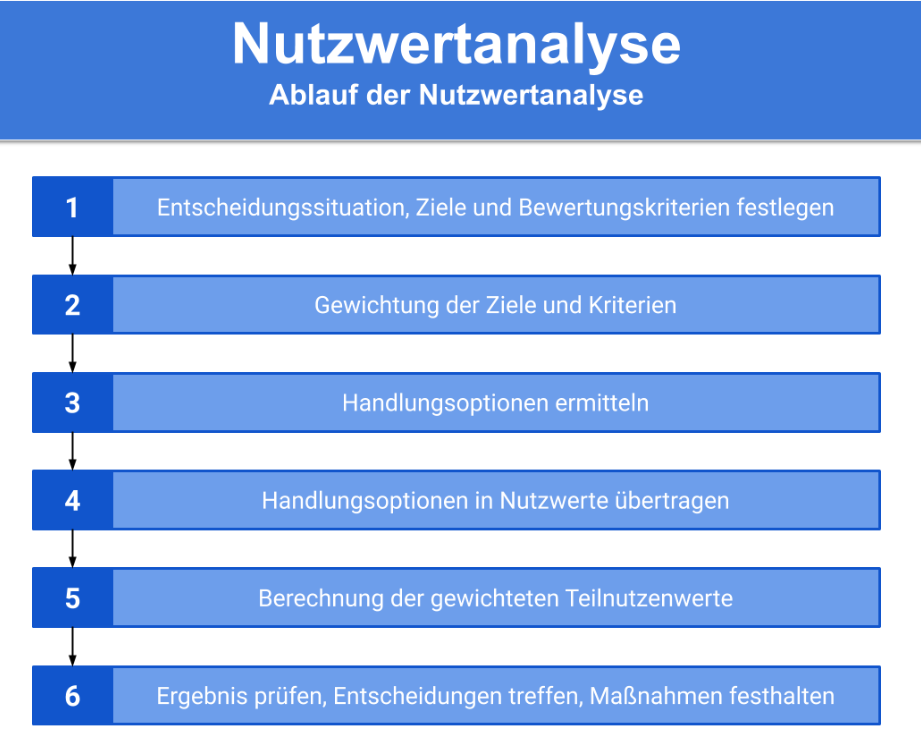

# Nutzwertanalyse

> Die Nutzwertanalyse ist eine Methode zur Planung von systematischen  
> Entscheidungen bei der Auswahl von Handlungsalternativen bei mehreren  
> Zielgrößen.

## Durchführung (Scoring Modell)
- Bewertungsmaßstäbe (Skala 1-4, gering bis hoch)
- Handlungsalternativen reduzieren
    - nicht realisierbare ausschließen
- Nutzwertanalyse umkehren -> Risikobewertung

1. Festlegen von Entscheidungsalternativen, Problemstellung
2. Definition von Bewertungskriterien (Ziel, Anforderungen erreicht)
3. Gewichtung der Kriterien (absolut/prozentual)
4. Festlegen des Bewertungsmaßstabs (Skala 1-6, sehr schlecht - sehr gut)
5. Bewertung, Punktevergabe, Gewichtung
6. Einzelgewichtung aus 5. (gewichtete Punktzahl / Handlungsalternativen)

### Allgemeiner




### Gesamtnutzenberechnung

```text
Gesamtnutzen =   GewichtungA * TeilnutzenA 
               + GewichtungB * TeilnutzenB 
                            ...
               + GewichtungN * TeilnutzenN
```