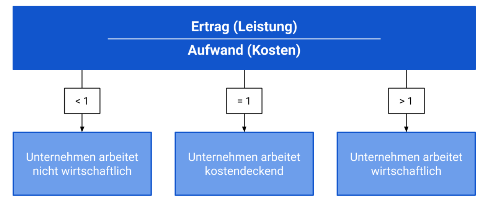
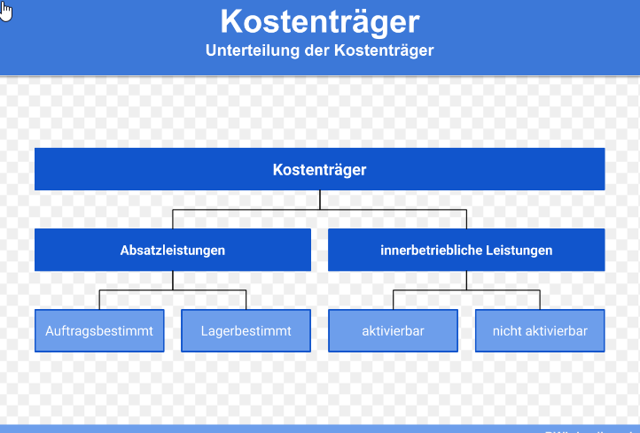
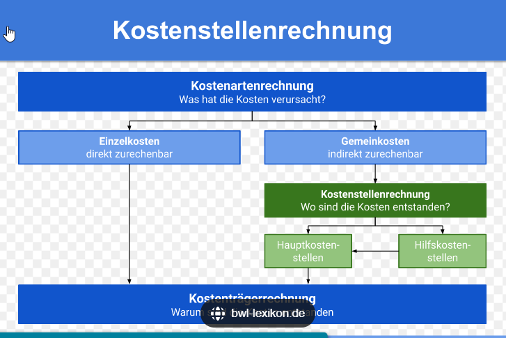

# Wirtschaftlichkeit

> Die Wirtschaftlichkeit ist eine **Kennzahl** der Ökonomie: 
> Verhältnis von Erträgen zu Kosten.

### Formel Wirtschaftlichkeit

```text
                       Erlös             Ertrag
Wirtschaftlichkeit =  --------   oder  ----------
                       Kosten            Aufwand
```
Das Ergebnis zeigt an
- größer als 1: Wirtschaflichkeit, je höher desto wirtschaftlicher  
- gleich 1: Kostendeckung  
- kleiner 1: Unwirtschaftlichkeit

Beispielrechnung:
```text
Erlös:       50,000€
            ---------  = 1,25 (Wirtschaftlichkeit)
Kosten:      40,000€ 
```



## Deckungsbeitrag
> Der Deckungsbeitrag ist die Differenz zwischen Erlösen und variablen Kosten.  
> Gehört zur Teilkostenrechnung.  

- Stückdeckungsbeitrag: von einem einzelnen produzierten Teil
- Gesamtdeckungsbeitrag: verfügbarer Betrag zur Deckung der Fixkosten

### Formeln Deckungsbeitrag
### Begriffe:  

- **Kostenträger**(Internes Rechnungswesen)  
  - **Produkte oder Dienstleistungen** eines Unternehmens  
    ihnen werden sämtliche Kosten und Leistungen zugewiesen
    - Ausgaben für Produktionsmittel
    - anteilige Lohnkosten der Mitarbeiter
  - **Absatzleistungen**
    - **Auftragsbestimmt:** Verkauf, Vertragsabschluss
    - **Lagerbestimmt:** Vorratshaltung
  - **Innerbetriebliche Leistungen**
    - **Aktivierbar:** Vermögenswerte, Maschinen, auch Personalverpflegung
    - **Nichtaktivierbar:** Aufwendungen zur Kontrolle von Plan-und Istkosten
- **Einzelkosten** 
  - direkt zuweisbar, identifizierbar und spezifisch  
- **Gemeinkosten**
  - werden mehreren Produkten zugerechnet
  - müssen auf Kostenstellen verteilt werden



- **Kostenstellen**
  - Abteilungen im Unternehmen
  - beurteilen, wo die Kosten anfallen


```text
Deckungsbeitrag = Erlöse - variable Kosten

Stückdeckungsbeitrag = Verkaufspreis - variable Kosten pro Stück
Gesamtdeckungsbeitrag = Stückdeckungsbeitrag x Absatzmenge
Gesamtdeckungsbeitrag - Fixkosten = Gewinn

Break-Even-Point: wieviele Produkte müssen verkauft werden, damit ein Gewinn erzielt wird?
```

Beispielrechnung:
```text
Verkaufspreis/Stück    : 5€     
Kosten/Stück           : 3€       Stückdeckungsbeitrag = 5 - 3 = 2€
Absatzmenge            : 200      Gesamtdeckungsbeitrag = 2 x 200 = 400€

Fixkosten(Miete/Strom) : 300€     Gewinn = 400€ - 300€ = 100€
```
### Deckungsbeitragsrechnung


