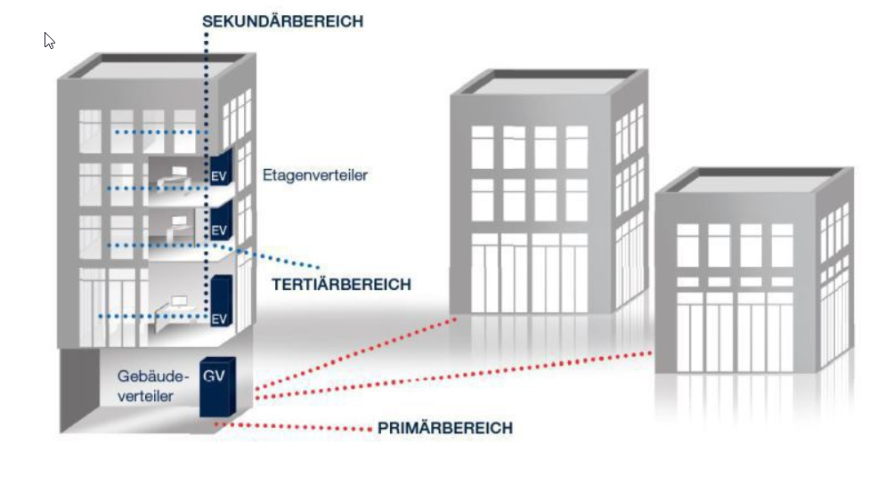
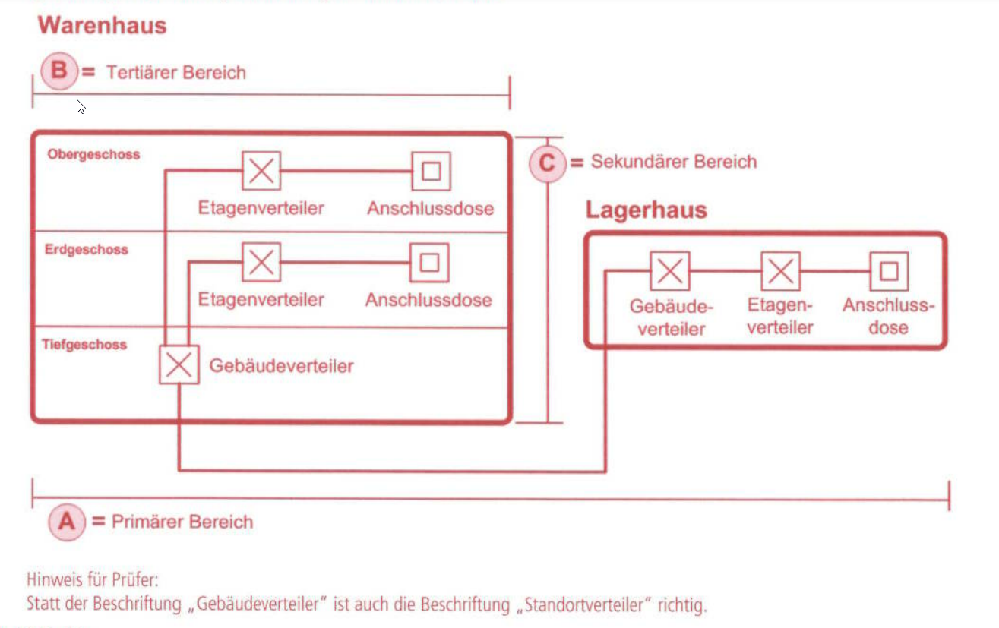

# Strukturierte Gebäudeverkabelung

- Primärbereich (horizontal, waagerecht)
  - Primärverkabelung
  - Standortverkabelung SV
  - Geländeverkabelung GV
- Sekundärverkabelung (vertikal, senkrecht)
  - Gebäudeverkabelung GV
- Tertiärbereich (horizontal, waagerecht)
  - Etagenverkabelung EV

## Lösung IHK

## Begriffe und Abkürzungen

### EMV (Elektromagnetische Verträglichkeit)

Europäische EMV-Richtlinie:
> die Fähigkeit eines Betriebsmittels, in seiner elektromagnetischen Umgebung  
> zufriedenstellend zu arbeiten, ohne dabei selbst elektromagnetische Störungen zu  
> verursachen, die für andere Betriebsmittel in derselben Umgebung unannembar wären

Arten von Störungen
- leitungsgebundene Störungen
  - Knackstörung, Spannungspuls beim Abschalten bspw des Kühlschranks -> knacken im Radio
- feldgebundene Störungen
  - Störfelder, Eindringen von Mobilfunk-Signalen in Audioeinrichtung

### Vorteile bei Verwendung von Glasfaserkabeln (LWL = Lichtwellenleiter):
- kein Nebensprechen (NEXT)
- geringere Dämpfung
- höhere Übertragungsraten
- größere Reichweiten möglich
- keine Erdung erforderlich
- kein Potenzialausgleich erforderlich

