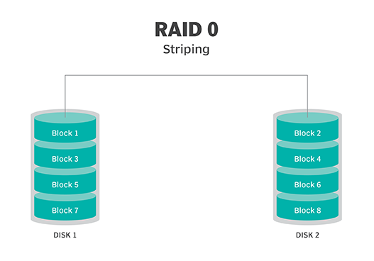

# RAID
> Redundant Array of Independent (früher auch Inexpensive) Disks

[Raid-Systeme einfach erklärt](https://simpleclub.com/lessons/fachinformatikerin-raid-systeme)

### Ziele von RAID
> Verbund von mindestens zwei physikalischen Massenspeichern (Festplatten, SSD)  
> zu einem logischen Laufwerk.  
> Durch gezielte Erzeugung von Redundanzen (außer RAID 0) werden die Integrität und  
> Funktionalität des Systems sichergestellt.  
> Nach Austausch einer fehlerhaften Komponente kann der Ursprungszustand wiederhergestellt werden.  

- Ausfallsicherheit (Redundanz)
- Leistungssteigerung (Datenübertragungsrate)
- Aufbau großer logischer Laufwerke
- Hot-Swopping von Speicher (Austausch im laufenden Betrieb)
- Kostenreduktion (viele kleinere Medien sind billiger als ein großes)

### Die Redundanz von RAID bedeutet *nicht* Datensicherung

# RAID - Level

> Spezifikationen des Zusammenwirkens der Speichermedien  
## RAID 0
### Speicherungstechnik Streifen (Striping)

- Verteilung der Daten auf mehrere Festplatten in Blöcken (Streifen)
- nur geeignet für unkritischen Speicher (der bei Verlust leicht wiederherzustellen ist)
- keine Redundanz, keine Parität
- bei Ausfall einer Platte Komplettverlust aller Daten
- schnelle Lese- und Schreibgeschwindigkeit
- Live-Stream-Caching, Videobearbeitung

