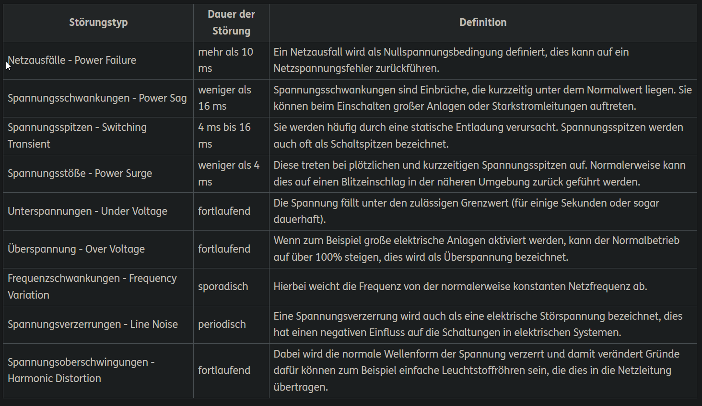
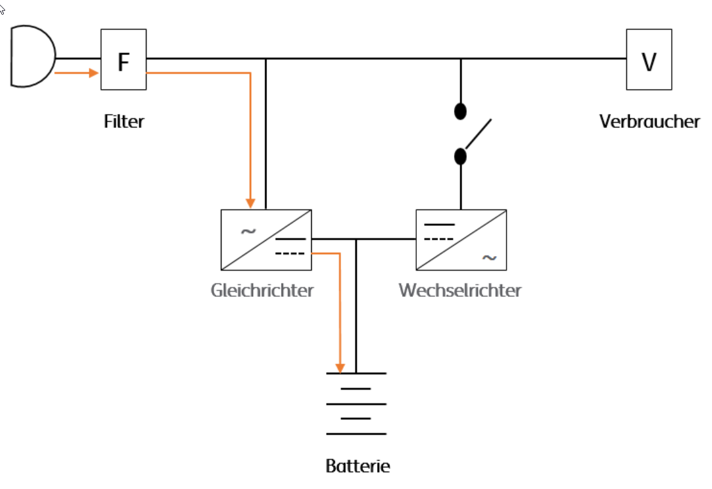
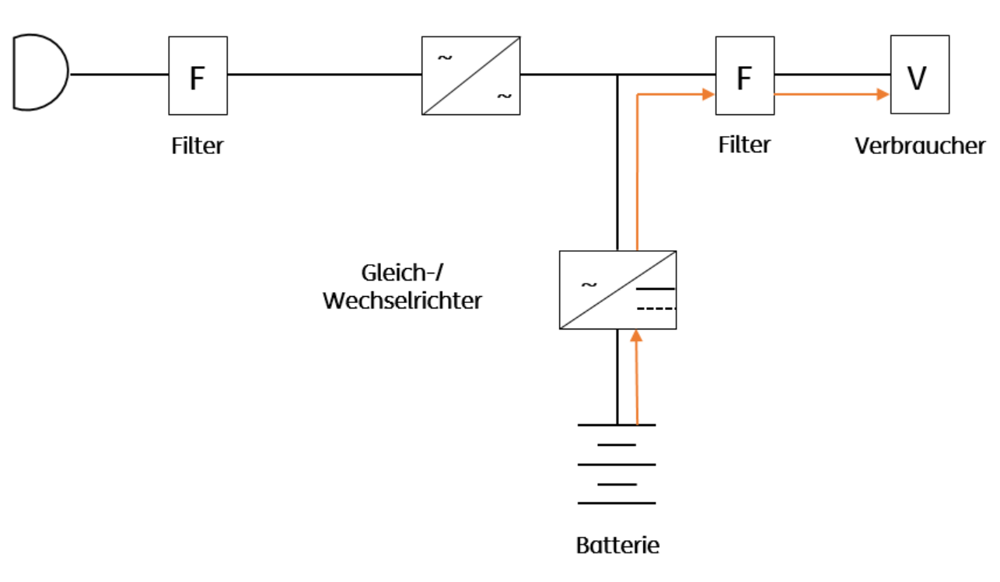
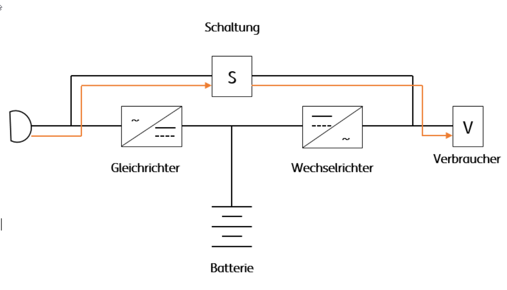

# USV - Unterbrechungsfreie Stromversorgung

> stellt sicher, dass die Daten eines sensiblen Systems, z.B. Server innerhalb  
> von Netzwerken, im Fall eines Stromausfalls gesichert werden können und die   
> Geräte ordnungsgemäss heruntergefahren werden.  
> Sie sind zwischen Netz und Verbraucher geschaltet und basitzen einen Akku,  
> der den Betrieb für kurze Zeit übernehmen und aufrechterhalten kann.

### Verschiedene Arten von Netzstörungen

## USV-Typen

### VFD (Voltage Frequency Dependent from Mains Supply)

- Standby- oder Offline-USV
- einfachste USV
- schützt bei (innerhalb weniger Millisekunden)  
  - totalem Netzausfall 
  - Spannungsspitzen (Über- oder Unterspannung)
- Aufladung des Akkus über Ladegleichrichter im Normalbetrieb
- Wirkungsgrad ca 95%
- Einsatz für Kleinst-Verbraucher oder Einzelrechner

### VI (Voltage Independent from Mains Supply)

- Line Interactive-USV oder Netzinteraktive-USV
- schützt bei
  - totalem Netzausfall
  - Spannungsspitzen
  - Spannungsschwankungen durch Spannungsregler
- Wirkungsgrad 95% - 98%
- Einsatz für einzelne Computersysteme, Netzwerke, grössere TK-Anlagen

### VFI (Voltage and Frequency Independent from Mains Supply)

- Online-USV
- maximaler Schutz bei
  - wie VI
  - Frequenzschwankungen
- ständige Versorgung des Verbrauchers über den Akku
  - daher keine Schaltzeiten
  - Dauerwandlerprinzip: ständiger Betrieb von Gleich- und Wechselrichter
- Wirkungsgrad nur ca 90%
- kurze Lebensdauer durch Dauerbelastung
- Einsatz in Server- und Datenkommunikation

