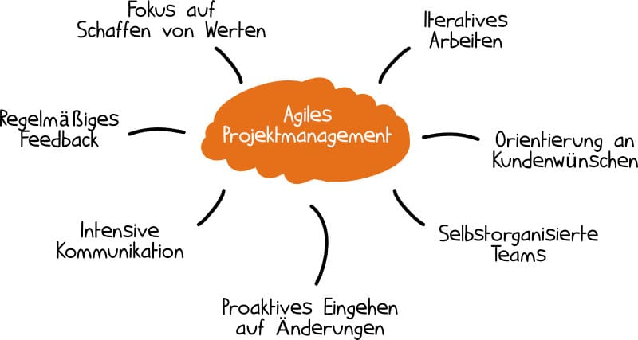

# Agiles Projektmanagement

> Sammelbegriff für verschiedene Projektmanagement-Methodiken wie  
> Scrum oder Kanban.  
> Hier werden in kurzen Abständen (Teil-)Ergebnisse geliefert, Stakeholder  
> können ihr Feedback geben und geänderte Anforderungen werden schnell  
> umgesetzt.  

  

## Manifesto for Agile Software Development

We are uncovering better ways of developing  
software by doing it and helping others do it.  
Though this work we have come to value:
- Individuals and interactions over processes and tools
- Working software over comprehensive documentation
- Customer collaboration over contract negotiation
- Responding to change over following a plan  

That is, while there is value in the items on  
the right, we value the items on the left more.  

1. Individuen und Interaktionen haben Vorrang vor Prozessen und Werkzeugen
2. Funktionsfähige Produkte haben Vorrang vor umfangreicher Dokumentation
3. Zusammenarbeit mit Kunden hat Vorrang vor Vertragsverhandlungen
4. Das Reagieren auf Änderungen hat Vorrang vor striktem Einhalten eines Plans

> Troztdem spielen Prozesse und Dokumentationen eine große Rolle im agilen  
> Projektmanagement. Der Unterschied liegt im Denkansatz und dass im Zweifel  
> ein adaptiver Ansatz statt einer strengen Planeinhaltung gewählt wird.

[Principles behind the Agile Manifesto](https://agilemanifesto.org/principles.html)

## Vor- und Nachteile

### Vorteile
- schrittweises Vorgehen
  - iterative Näherung an komplexe Lösungen im Austausch Team <-> Kunde
- regelmäßige Ergebnisse
  - getestete Teilabschnitte stehen zur Verfügung
  - ideale Feedbackpunkte zum weiteren Vorgehen
- verringertes Risiko durch flexible Reaktion auf Anforderungsänderungen
- höhere Kundenzufriedenheit durch regelmäßiges Feedback
- Projektsteuerung anhand von Ergebnissen
  - Kennzahlen wie Anzahl Releases/Jahr, Fehler/Release und Grad der Kundenzufriedenheit  
    sind vorhanden, nicht nur Schätzungen
- weniger Dokumentation
  - nur soviel wie unbedingt nötig

### Nachteile
- weniger vorhersehbar
- unpräzise Anforderungen bergen die Gefahr das Projekt aus dem Ruder laufen zu lassen
- hohes Maß an Zusammenarbeit erfordert jederzeit verfügbare Team-Ressourcen
- zu wenig bzw vernachlässigte Dokumentation

