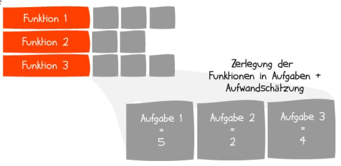

# Agiles Projektmanagement

> Sammelbegriff für verschiedene Projektmanagement-Methodiken wie  
> Scrum oder Kanban.  
> Hier werden in kurzen Abständen (Teil-)Ergebnisse geliefert, Stakeholder  
> können ihr Feedback geben und geänderte Anforderungen werden schnell  
> umgesetzt.  

  

## Manifesto for Agile Software Development

We are uncovering better ways of developing  
software by doing it and helping others do it.  
Though this work we have come to value:
- Individuals and interactions over processes and tools
- Working software over comprehensive documentation
- Customer collaboration over contract negotiation
- Responding to change over following a plan  

That is, while there is value in the items on  
the right, we value the items on the left more.  

1. Individuen und Interaktionen haben Vorrang vor Prozessen und Werkzeugen
2. Funktionsfähige Produkte haben Vorrang vor umfangreicher Dokumentation
3. Zusammenarbeit mit Kunden hat Vorrang vor Vertragsverhandlungen
4. Das Reagieren auf Änderungen hat Vorrang vor striktem Einhalten eines Plans

> Troztdem spielen Prozesse und Dokumentationen eine große Rolle im agilen  
> Projektmanagement. Der Unterschied liegt im Denkansatz und dass im Zweifel  
> ein adaptiver Ansatz statt einer strengen Planeinhaltung gewählt wird.

[Principles behind the Agile Manifesto](https://agilemanifesto.org/principles.html)

## Vor- und Nachteile

### Vorteile
- schrittweises Vorgehen
  - iterative Näherung an komplexe Lösungen im Austausch Team <-> Kunde
- regelmäßige Ergebnisse
  - getestete Teilabschnitte stehen zur Verfügung
  - ideale Feedbackpunkte zum weiteren Vorgehen
- verringertes Risiko durch flexible Reaktion auf Anforderungsänderungen
- höhere Kundenzufriedenheit durch regelmäßiges Feedback
- Projektsteuerung anhand von Ergebnissen
  - Kennzahlen wie Anzahl Releases/Jahr, Fehler/Release und Grad der Kundenzufriedenheit  
    sind vorhanden, nicht nur Schätzungen
- weniger Dokumentation
  - nur soviel wie unbedingt nötig

### Nachteile
- weniger vorhersehbar
- unpräzise Anforderungen bergen die Gefahr das Projekt aus dem Ruder laufen zu lassen
- hohes Maß an Zusammenarbeit erfordert jederzeit verfügbare Team-Ressourcen
- zu wenig bzw vernachlässigte Dokumentation

### Verbreitung der verschiedenen Modelle

# Scrum

## Definition

> ... ein Rahmenwerk (Framework), mit dessen Hilfe Menschen komplexe adaptive  
> Aufgabenstellungen angehen und sowohl produktiv als auch kreativ Produkte in  
> höchster Qualität ausliefern können.  

Laut Scrum-Guide ist Scrum ein allgemeines Framework für agiles Vorgehen,  
- kein Prozess zu Software-Entwicklung
- kene Technik oder Methode
- kein Prokuktentwicklungsprozess
- keine Sammlung von Best Practices  
### 1. Ein Framework
Diese Rahmenwerk besteht aus **Scrum-Teams** und ihren    
- **Verantwortlichkeiten (Accountabilities)**,  
- **Ereignissen (Events)**
- **Artefakten (Artefacts)**
- **Regeln (Rules)**

### 2. Für komplexe adaptive Aufgabenstellungen
ist geeignet für innovative Projekte, deren Erreichung keine vordefinierte  
Vorgehensweise haben, der Weg zu Lösung also im Prozess erarbeitet werden muss.  

### 3. Prokukte in höchster Qualität
Durch Mechanismen wie schnelles Feedback und Anforderungsanpassungen wird eine  
hohe Qualität erreicht.  

## Die 3 Säulen von Scrum

- Transparenz
  - alle Informationen und Ergebnisse über das Projekt sind für alle sichtbar
  - allgemeine Standards zur missverständnisfreien Informationsinterpretation
- Überprüfung
  - Kontrolle und Feedback
- Anpassung
  - Kurskorrekturen, Verbesserung der Arbeitsergebnisse und Prozesse

## Einsatzgebiete
- Produktentwicklung
- Marketing- und Designprojekte
- Verwaltung
- Versicherungs- und Finanzbranche
- Universitäten
- Personalbereich, Human Resources

## Die 5 Scrum-Werte

- Selbsverpflichtung (commitment)
- Offenheit (openness)
- Mut (courage)
- Respekt (respect)
- Fokus (focus)

> Diese werden explizit im Scrum-Guide bzw Framework propagiert, damit sie nicht  
> vernachlässigt werden.  

## Scrum Framework - Überblick

### bis zur Fertigstellung des Produkts wird der Prozess zyklisch durchlaufen

1. **Product Owner** erstellt **Product Backlog** vergleichbar mit Lastenheft
2. **Sprint-Planung** die Aufgaben höchster Priorität kommen ist **Sprint-Backlog**
3. **Sprint** - 2-4 Wochen Abarbeitung des **Sprint-Backlog**, **Daily-Scrum** Besprechungen
4. **Scrum Master** sorgt für Einhaltung von Prozessen,   
     Beseitigung von Hindernissen und Zielfokussierung

5. **Inkrement** - auslieferungsfähiges Ergebnis am Sprintende
6. **Sprint-Review** und **Retrospektive** in weiteren Meetings mit Stakeholdern  

## Definition of Done

> Festlegung von Kriterien, nach denen das Produkt als fertiggestellt angesehen  
> wird.  

- alle Beteiligten wissen wann ein Element aus dem Backlog 'Done' ist
- zu jedem Element gibt es Abnahmekriterien
- ein 'Done'-Inkrement ist Auslieferbar und hat eine hohe Qualität
- im Unternehmen können allgemeine Standards oder Konventionen herrschen

## Rollen im Framework (Roles)

### Product Owner
> fungiert als Wertemaximierer und Vermittler zwischen Stakeholdern, der Organisation  
> und den Developern. 
> Ist dafür verantwortlich, den Wert eines Produkts und die Lestung der Developer zu  
> maximieren.  

- verantwortlich für Projektinhalt
- hat klare Vorstellung vom Projekt
- behält den betriebswirtschaftlichen Überblick

### Scrum Master
> Wächter über Scrum. Hilft allen Beteiligten, die Scrum-Guidelines zu verstehen und    
> anzuwenden.  
> Steht im Dienste des Teams und sorgt dafür, dass das Team produktiv arbeiten kann,  
> indem er Hindernisse ausräumt und vor äußeren Einflüssen schützt.  
> Übt keine inhaltliche Kontrolle aus. 

- verantwortlich für den Scrum-Prozess
- Coach, Mentor und Moderator
- Problemlöser, beseitigt Hindernisse

### Developer
> Entwickeln zu jedem Sprintende ein potenziell auslieferbares Produktinkrement  
> das der 'Definition of Done' entspricht.

- 3 - 9 Mitglieder
- verantwortlich für die Umsetzung
- das Team sollte cross-functional besettzt sein:
  - Designer
  - Programmierer
  - Tester

## Ereignisse (Events)

> Sprints sind Mini-Projekte innerhalb eines Scrum-Projekts.  
> Sie haben ein definiertes Ziel und sind maximal einen Monat lang.

### Events mit maximaler Dauer (Timebox)

- Sprint - Container für andere Ereignisse
- Sprint-Planung zu Beginn
- Daily Scrum - tägliches Meeting
- Sprint-Review - Präsentation und Analyse des Sprint-Ergebnisses
- Sprint-Retrospektive - Analyse des Prozesses und der Zusammenarbeit

### Sprint Planung
1. Was ist das Sprint-Ziel?
2. Was kann während dieses Sprints erledigt werden?
3. Wie wird die ausgewählte Arbeit erledigt?

### Daily Scrum

> Ablauf ist nicht durch Scrum-Guide vorgeschrieben. In der Regel 15 min lang  
> und im stehen, deshalb auch Standup genannt.  
> Täglich zur gleichen Zeit am gleichen Ort.

1. Was habei ich gestern getan?
2. Was tue ich heute?
3. Welche Probleme und Hindernisse traten auf?

### Sprint-Review

> Wichtig für die Zusammenarbeit und Kommunikation zwischen Developern und  
> Stakeholdern. 
> Diskussion von Markterwartungen, Zeitplänen und Budgets sowie von   
> Funktionen und Features.  

- Produktinkrement präsentieren
- Feedback einholen
- Product Backlog überarbeiten falls Änderungen des Marktes auftreten

### Sprint-Retrospektive

> Am Ende jedes Sprints können die eigenen Prozesse überprüft und angepasst werden.  
> Inspect & Adapt  

- Wie lief die **Zusammenarbeit**?
- Wurden **Prozesse** eingehalten?
- Wurden **vorhandene Werkzeuge** eingesetzt?
- Was hat **gut funktioniert** und was kann/muss **verbessert werden**?

## Artefakte (Artefacts)

> Bestimmte Form von Dokumenten oder Teilen eines Produkts.  

- Product Backlog
  - vom Product Owner gepflegt und priorisiert
  - alle Funktionen und Aufgaben die enthalten sein bzw. erledigt werden müssen
  - z.B. Liste aller Features einer Software
- Sprint Backlog
  - Teilmenge des Product Backlogs
  - Funktionen aus der Sprint-Planung für den aktuellen Sprint
- Inkrement
  - Ergebnis eines Sprints
  - potentiell auslieferbares (Teil-)Produkt
  - Definition of Done

## Product Backlog

> ist eine sortierte Liste (nach Priorität) aller Funktionen des geplanten Produkts.  
> Diese werden der Reihe nach abgearbeitet.  
> Die Liste ist ständigen Veränderungen ausgesetzt.  

Im Product Backlog enthaltene Elemente:  
- Funktionen und Eigenschaften des zu entwickelnden Produkts
- Änderungen und Anpassungen
- Fehlerbehebungen/Defekte

## Sprint Backlog

> besteht aus den Elementen des Product Backlog die für den aktuellen Sprint ausgewählt  
> wurden, ergänztz durch einen Plan zur Umsetztung der Funktionen:  
> Zerlegung der Elemente in Teilaufgaben.  

## Inkrement

> ist die Summe aller erledigten Product Backlog Einträge des aktuellen Sprints plus  
> der Inkremente der vorherigen Sprints. Alle müssen der vorher festgelegten  
> 'Definition of Done'  entsprechen.  

## Scrum skalieren

> Wenn mehrere Teams an einem Projekt arbeiten oder die Prozesse in einem Unternehmen  
> aus mehreren oder allen Unternehmensbereichen ineinandergreifen müssen wird der  
> Scrum-Prozess skaliert.  

Herausforderungen dabei sind:
- mehrere Teams koordinieren
- Tests und Integration der verschiedenen Inkremente ineinander
- Verwaltung mehrerer Backlogs
- Projekte und Teams müssen ihre Arbeit an übergreifender
  Unternehmensstrategie ausrichten

Nun werden auch mehr Schnittstellen, Hierarchien und Kommunikation benötigt.  
Die bekanntesten Ansätze zur Skalierung sind:
- **LeSS** - kleine bis mittelgroße Skalierung, eng an originalem Scrum orientiert
- **Scrum@Scale** - sinnvoll für Einsatz im gesamten Unternehmen, große Skalierung
- **Scrum of Scrums (SoS)** - für mehrere Teams am Produkt, S-o-S-Meetings
- **Nexus** - eng am original mit zusätzlichen Rollen, Events und Artefakten
- **Spotify Modell, Spotify Engineering Culture** - mehrere Teams arbeiten  
    an verschiedenen komponenten eines Services oder Produkts
- **SAFe** - Top-Down-Ansatz mit mehreren Ebenen - zusätzliche Rollen Events und Artefakte
