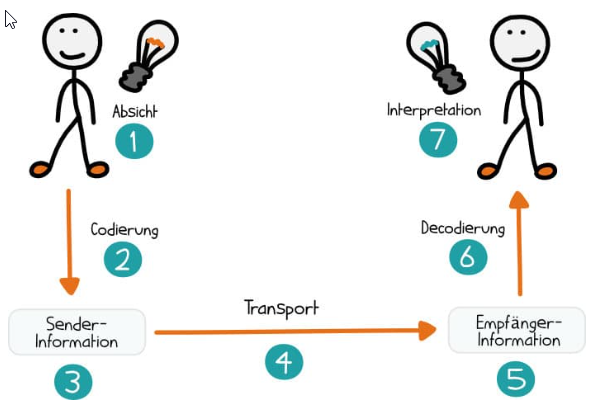
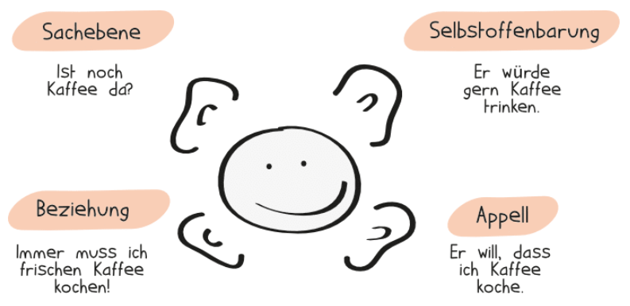
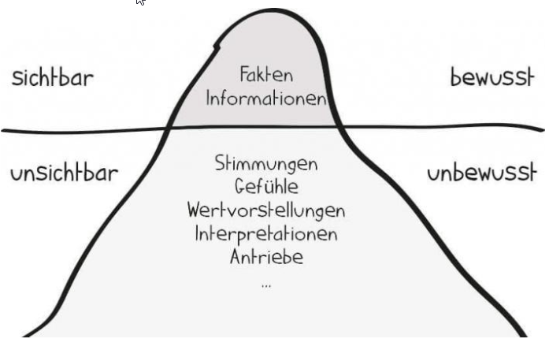
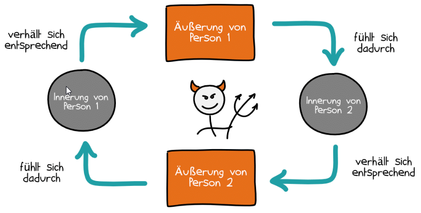
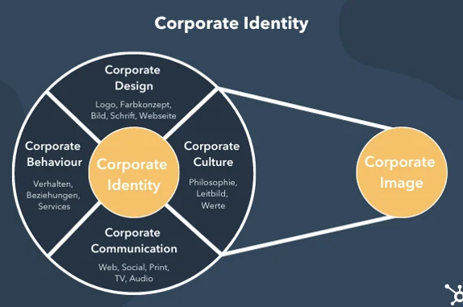
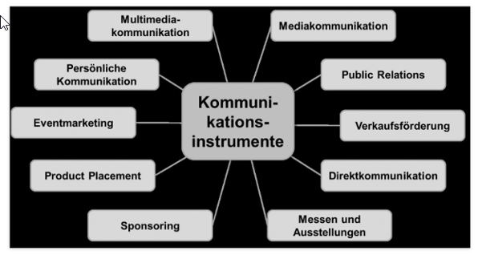
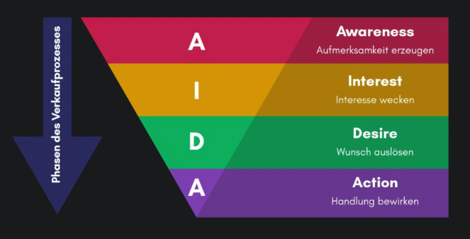

# Kommunikation

### Definitionen für Kommunikation
Gabler Wirtschaftslexikon
> Prozess der Übertragung von Nachrichten zwischen einem Sender und  
> einem oder mehreren Empfängern.  

Duden  
> Versändigung untereinander; zwischenmenschlicher Verkehr besonders  
> mithilfe von Sprache, Zeichen.  

Wikipedia  
> Kommunikation (lat coummunicatio 'Mitteilung') ist der Austausch oder  
> die Übertragung von Informationen.  

  

### 1. Absicht zur Informationsübermittlung
- Störung: Informationsübermittlung wird vergessen
### 2. Codierung beispielsweise in Worte
- Störung: Wortfindungsschwierigkeiten
### 3. Senden der Information durch Aussprechen
- Störung: undeutliche Aussprache
### 4. Übermittlung durch Schall
- Störung: schlechter Empfang, Nebengeräusche
### 5. Empfang des Signals
- Störung: das Signal ist akustisch nicht zu verstehen
### 6. Decodierung der Worte
- Störung: fremde Sprache, fehlende Fachkompetenz
### 7. Interpretation, Erfassung der Bedeutung
- Störung: Fehlinterpretation durch Missvertändnisse

## Die 3 Kategorien der Kommunikationsprobleme

### Probleme auf Seite des Senders:
- Fachsprache
- starker Dialekt
- inkorrekte Aussprache
- Widersprüche in den Informationen
- unklare Formulierung
- Suggestivfragen
### Probleme auf Seite des Empfängers:
- selektive Wahrnehmung
- Unverständnis
- Fehlinterpretation
- mangel an Konzentration
- vorschnelles Urteilen
### Probleme durch ungünstige Rahmenbedingungen
- ungleiches Sprachniveau und Sprachverständnis
- laute Umgebung
- schlechte Verbindung

# Kommunikationssmodelle (Schulz von Thun)

## Kommunikationsquadrat (4-Ohren-Modell)

  

### Die vier Ebenen
1. Sachebene (worüber informiere ich)
2. Selbstoffenbarung (was gebe ich von mir preis)
3. Beziehung (wie stehen die Partner zueinander)
4. Appell (was will ich beim Informierten erreichen)

## Eisbergmodell

> Nach diesem Modell sind nur 20% einer Botschaft direkt wahrnehmbar.  
> Das sind die Sachinformationen wie Zahlen, Fakten und Daten.  
> 80% sind versteckte Botschaften auf der Gefühls- und Beziehungsebene.  
> Das führt zu Missverständnissen oder es wird aneinander vorbei geredet.  

Es kann also bei einer Aussage zu verschiedenen (Fehl-)Interpretationen kommen.  
Projektleiter: "Ich hätte gern, dass *Sie* diesmal die Präsentation halten."
- Interpretation 1: "Ich bin sehr zufrieden mit Ihrer Arbeit und möchte Ihnen  
  die Möglichkeit geben, diese auch selbst zu präsentieren."
- Interpretation 2: "Ich habe keine Lust, die Präsentation vorzubereiten und  
  wälze das lieber auf Sie ab."
- Interpretation 3: "Sie haben sich immer davor gedrückt, aber jetzt sind Sie dran!"

#### Missverständnisse und Konflikte verringern durch:
- aktives Zuhören
- Nutzen verständlicher Formulierungen
- Bereitschaft nachzufragen
- Einholen von Feedback
- Beachtung persönlicher Hintergründe
- Kommunikations- und Verhaltensregeln

## Teufelskreismodell

  

> Innerungen sind die inneren, nicht sichbaren Reaktionen der Empfänger auf  
> die sichtbaren Äußerungen der Sender.  

> Teufelskreis 1:
> Karl beschwert sich bei Nicole, dass sie immer alle Aufgaben an sich  
> reißen würde (= Äußerung Person 1). Nicole fühlt sich dadurch alleingelassen und  
> verantwortlich (= Innerung Person 2). Ihre Reaktion darauf ist, dass sie  
> mehr Verantwortung übernimmt und mehr in Erscheinung tritt, indem sie sagt:  
> 'Du ruhst dich auf meine Kosten doch nur aus!' (= Äußerung Person 2).  
> Karl fühlt sich übergangen, ist verärgert und trotzig (= Innerung Person 1).  
> Dies führt zu einer Verstärkung seines Eindrucks, dass Nicole doch alles an  
> sich reißen würde usw.

> Teufelskreis 2:  
> Gustav will jede freie Minute mit Paula verbringen. Sie möchte gerne mal Zeit  
> für sich haben. Gustav mach Paula den Vorwurf er wäre ihr nicht mehr wichtig.  
> Paula fühlt sich unter Druck gesetzt und zieht sich zurück, weil sie keine Lust  
> auf diese Vorwürfe hat und findet Gustav sei nur noch schlecht gelaunt.....  

# Kommunikationspolitik (vierte Säule des Marketings)

> Kommunikationspolitik bezeichnet die Gesamtheit aller Kommunikationsmaßnahmen  
> innerhalb und außerhalb eines Unternehmens sowie deren Planung, Ausarbeitung,  
> Abstimmung und Überprüfung mittels einer festgelegten Kommunikationsstrategie.  

### Vier Säulen des Marketings
- Product (Produktpolitik)
- Price (Preispolitik)
- Place (Distributionspolitik)
- Promotion (Kommunikationspolitik)

## Zielgruppe (Basis der Kommunikationspolitik)

> Bedürfnisse und Wünsche der Zielgruppe studieren und anhand dessen die anzuwendenden  
> Instrumente auf die Empfänger abstimmen.  
> Eigenschaften und Anforderungen verschiedener Zielgruppen können stark variieren.  
> Es gilt herauszufinden welche Faktoren einen positiven oder negativen Einfluss auf  
> die jeweilige Zielgruppe haben.  

Informationen über Potentielle Kunden sammeln  
(Buyer Personas: fiktive, verallgemeinerte Darstellung des idealen Kunden):
- **wie und wann** fällt die Kaufentscheidung
- **wo** informieren sie sic
- **wie** kann man sie erreichen

### Corporate Identity
> Kommunikationspolitik ist nicht nur Werbung, sondern umfasst Instrumente und Prozesse  
> der Corporate Identity und des Corporate Image.  

## Bestandteile einer Kommunikationsstrategie
> Grundlage für ein authentisches Image, das sich langfristig auf die Wahrnehmung  
> eines Unternehmens auswirkt.  
> Klare Ziele und Bezug zur Corparate Identity sind besonders wichtig.  

### 1. Kommunikationsziele bestimmen
> Was soll mit der Strategie erreicht werden?

Definition von Zielen:
- Brand Awareness
- Erhöhung der Reichweite
- Interaktion der Nutzer
- Transaktion
- Corporate Image
- Kundenbindung
### 2. Ausarbeitung einer Strategie
> Herausfinden, welche Maßnahmen und Instrumente die Unternehmerischen Ziele  
> erreichen können.

Festlegung von:
- passenden Kanäle
- reichtigem Zeitraum
- Kommunikationsbotschaften für die Zielgruppe

### 3. Budget festlegen
> Wie sollen die zur Verfügung stehenden Mittel verteilt werden?

- vorläufiges Budget
- ggf Überdenken und Anpassen von Maßnahmen   
  damit die Rentabilität erhalten wird

### 4. Regelmäßige und kontinuierliche Kontrolle
> In regelmässigen Abständen kontrollieren, ob die Ziele erreicht wurden  
> und wie effektiv die Maßnahmen waren.  
> Anhand des AIDA Modells überprüfen, ob für alle Phasen passgenaue Strategien  
> entwickelt worden sind und angeboten werden.  

## Klassische Kommunikationsinstrumente

### Öffentlichkeitsarbeit (PR)
Besonders auf das Gesamtimage ausgerichtet:
- Pressearbeit
- Kontaktpflege
- soziales Engagement
### Persönliche Kommunikation / Persönlicher Verkauf
> direktes Verkaufsgespräch zwischen Unternehmen und Kunden
### Klassische Werbung (above-the-line)
Massentauglich einen Kaufgrund vermitteln:
- Fernsehen
- Tageszeitungen
- Plakate
### Verkaufsförderung
Unterstützende Maßnahmen zur Unterstützung des Absatzes eines Produktes
- Produktproben
- Gutscheine

## Weiter Kommunikationsinstrumente (below-the-line)
> Meist parallel und in Abstimmung mit den klassischen Kommunikationsinstrumenten  
> genutzt.  

Alle Maßnahmen, die sich direkter und persönlicher an die Zielgruppe richen:
- Sponsoring
- Eventmarkting
- Direktmarketing
- Messen und Ausstellungen
- Native Advertising
- Content Marketing
- Social-Media-Marketing

# AIDA Prinzip (Modell)

### AIDA-Formel:
- Attention: Aufmerksamkeit erzeugen
- Interest: Interesse wecken
- Desire: Wunsch auslösen
- Action: Handlung bewirken

