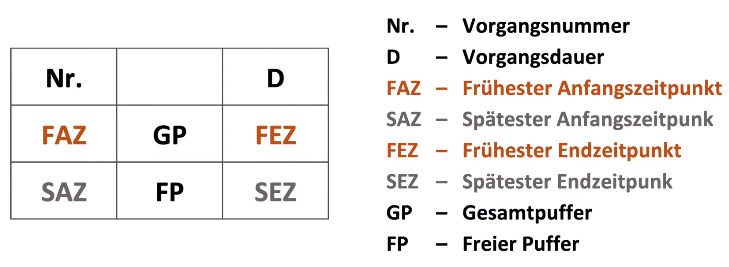
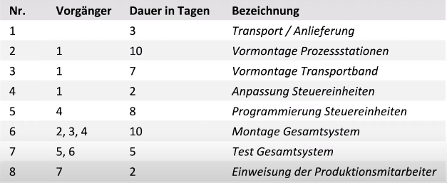
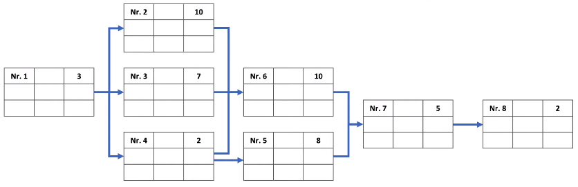
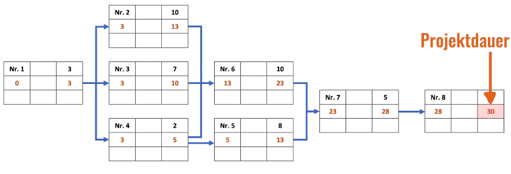
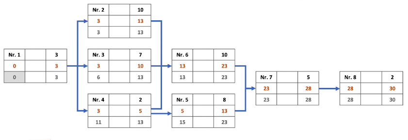
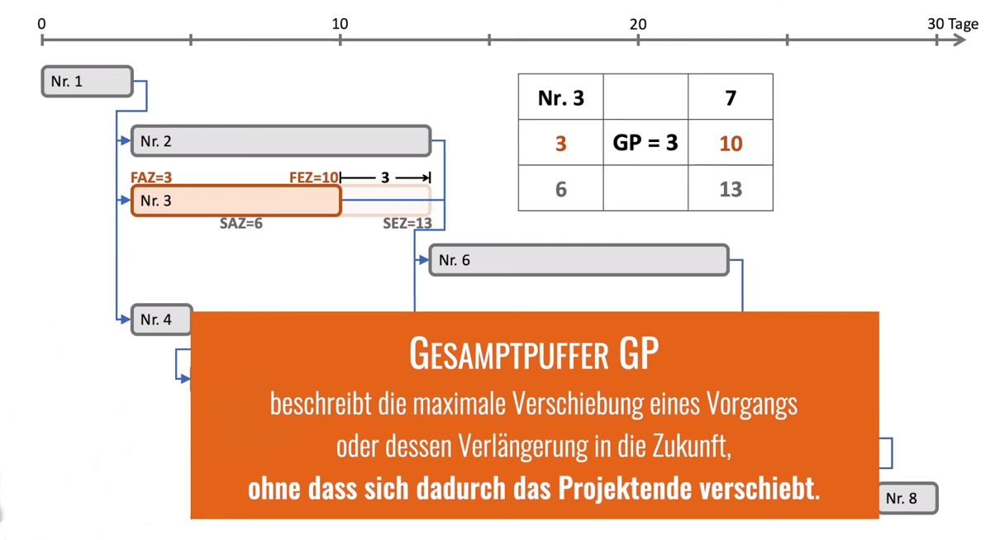
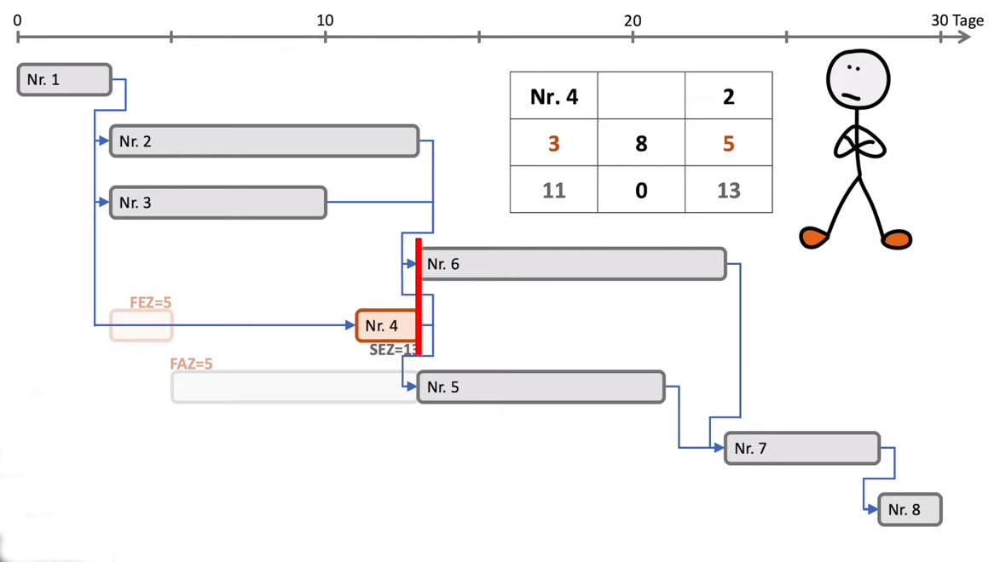
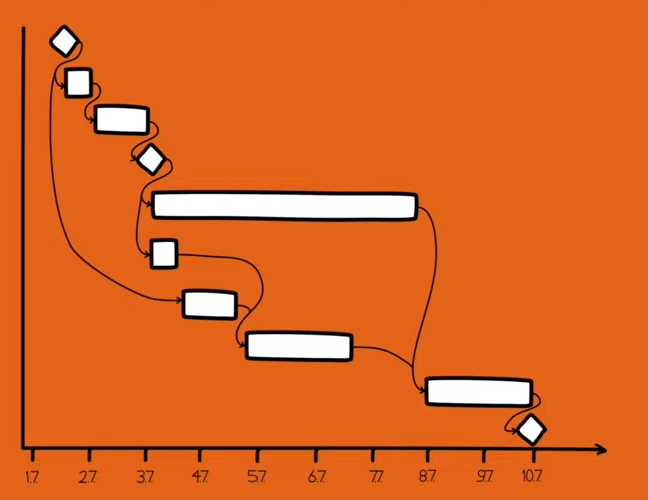

# Netzplantechnik

> Im Netzplan werden alle Vorgänge eines Projektes nach ihren Abhängigkeiten und Reihenfolgen  
> verkettet und grafisch dargestellt. So wird die Dauer des Projekts und der kritische Pfad ermittelt.  
> Jeder Vorgang wird durch einen Vorgangsknoten repräsentiert, der Start- und Endzeitpunkte sowie  
> Pufferzeiten enthält.

## Vorgangsknoten-Netzplan
- früheste und späteste Zeitpunkte
- Pufferzeiten
- Projektdauer
- Kritischer Pfad

## Vorgehensweise

### Informationen im Vorgangsknoten

### vorgegebene Vorgangsliste

### 1. Verknüpfung der Vorgänge mit Anordnungsbeziehungen

### 2. Vorwärtsrechnung
- früheste Anfangszeitpunkte (FAZ)
    - immer 0!
- früheste Endzeipunkte (FEZ)
- Projektdauer
> FEZ = FAZ + D  
> bei Normalfolge:  
> FAZ = größter FEZ vom Vorgänger

### 3. Rückwärtsrechnung
- späteste Anfangszeitpunkte (SAZ)
- späteste Endzeitpunkte (SEZ)

> SAZ = SEZ -D  
> bei Normalfolge:  
> SEZ = SAZ vom Nachfolger

### 4. Pufferzeiten
- Gesamtpuffer (GP)
- Freier Puffer (FP)
- Kritischer Pfad

### Darstellung im Gantt Diagramm (Balkenplan)
> GP = SEZ - FEZ = SAZ - FAZ

  

> Freier Puffer (FP)  
> **FP = niedrigster FAZ der/des Nachfolger/s - FEZ**  
> beschreibt, wie weit ein Vorgang verschoben oder verlängert werden kann,  
> ohne dass es Einfluss auf die Lage der benachbarten Vorgänge hat.

  

### Kritischer Pfad
- alle Vorgänge, bei denen sich eine Verzögerung unmittelbar  
  auf den Projektendtermin auswirkt
- für jeden Vorgang auf dem Pfad gilt: **GP = 0**
- diese Vorgänge bestimmen die **Gesamtprojektdauer**

## Netzplan und Gantt-Chart im Vergleich

| Netzplan                             | Gantt-Chart                    |
|--------------------------------------|--------------------------------|
| Abhängigkeiten der Vorgänge          | Abhängigkeiten der Vorgänge    |
| Berechnung der:                      | Darstellung:                   |
| - frühesten und spätesten Zeitpunkte | - von Ablauf und Terminplanung |
| - Puffer                             | - des Projektstandes           |
| - Projektdauer                       | - von Planänderungen           |
| Bestimmung des Kritischen Pfads      |                                |

### Einbeziehung von Meilensteinen im Gantt-Chart
> Meilensteine sind Zeitpunkte, haben keine Dauer und werden  
> als Rauten dargestellt.

