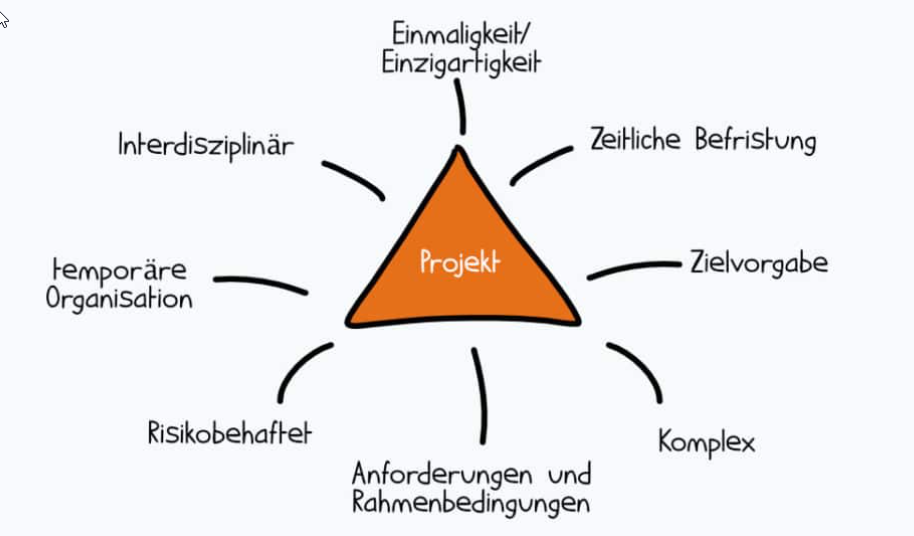
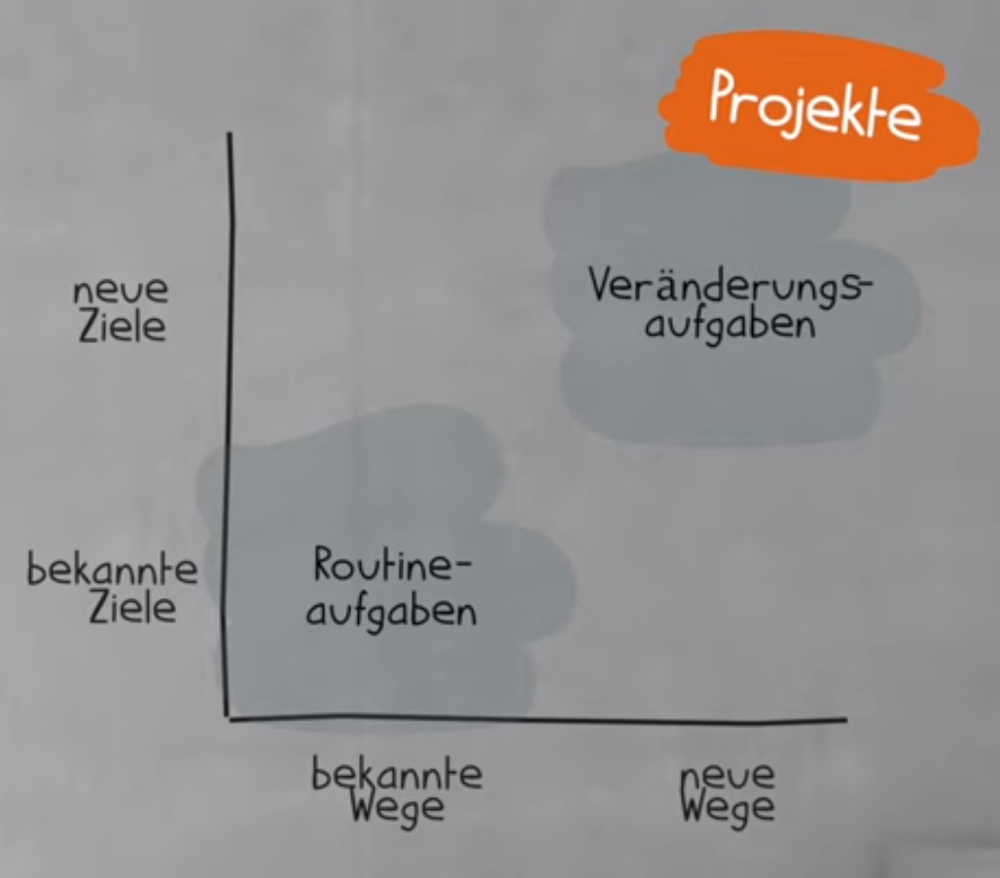
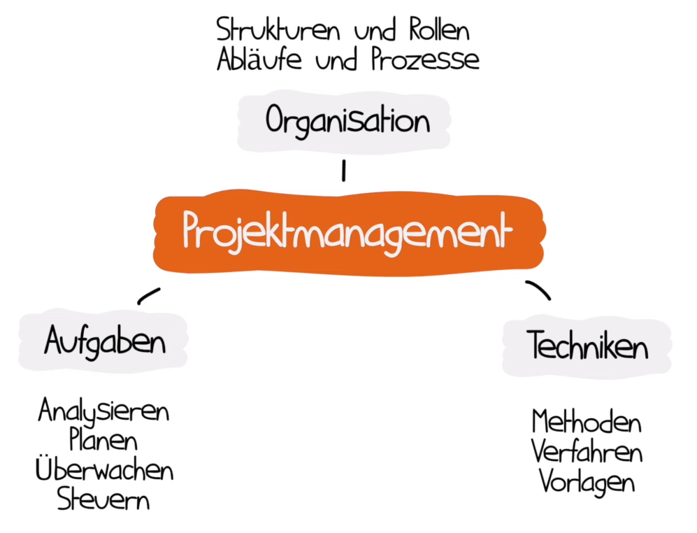
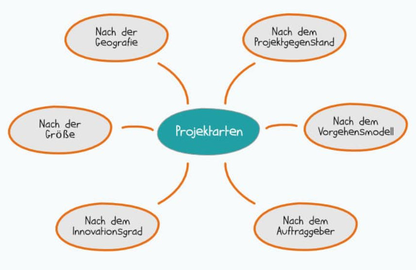
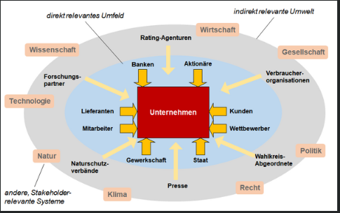

# Projektmanagement
## Projekt-Definitionen der Projektmanagement Verbände

ICB 4.0 Standard der IPMA
> Ein Projekt ist definiert als einmaliges, zeitlich begrenztes, interdisziplinäres  
> und organisiertes Unterfangen, um festgelegte Arbeitsergebnisse im Rahmen vorab  
> definierter Anforderungen und Randbedingungen zu erzielen.  

PMI
> A project is a temporary endeavor undertaken to create a unique product,  
> service or result.
> 
> Ein Projekt ist ein zeitlich begrenztes Vorhaben, mit dem ein einzigartiges  
> Produkt, eine Dienstleistung oder ein Ergebnis geschaffen weden soll.  

PRINCE2
> ...a temporary organization that is created for the purpose of delivering one  
> or more business products according to an agreed Business Case  
> 
> ..als eine temporäre Oganisation, die aufgesetzt wird zum Zwecke der Bereit-  
> stellung einer oder mehrerer Business Produkte gemäß eines vereinbarten Business Case.  

Definition nach DIN 69901
> Ein Projekt ist ein Vorhaben, das im Wesentlichen durch Einmaligkeit der  
> Bedingungen in ihrer Gesamtheit gekennzeichnet ist, wie z.B. Zielvorgabe,  
> zeitliche, finanzielle, personelle oder andere Bedingungen, Abgrenzngen gegen-  
> über anderen Vorhaben und projektspezifische Organisation.  
 

## 6 Merkmale eines Projekts

1. Zielvorgabe
2. zeitliche Begrenzung
3. begrenzte Ressourcen
4. projektspezifische Organisationsform
5. neuartig / einmalig
6. Komplexität

## Projektmanagement Definitionen
DIN 69901
> Das Projektmanagement umfasst die Gesamtheit von Führungsaufgaben, -organisation,  
> -techniken und -mitteln für die Abwicklung eines Projekts.  

Gabler Wirtschaftslexikon
> Projektmanagement umfasst die Führungsaufgaben, -organisation, -techniken und  
> -mittel zur erfolgreichen Abwicklung eines Projekts.  

Komplexe Vorgänge ...
- planen
- durchführen
- steuern
- kontrollieren
- kommunizieren 

## Vorteile des Projektmanagements 
- Effizienzsteigerung 
  - durch klare Ziele, Zeitpläne, Verantwortlichkeiten
- Kostenkontrolle
  - Planung und Überwachen von Ressourcen
- Risikomanagement
  - potenzielle Probleme früh erkennen
- Qualitätssicherung
  - klare Standards und Kontrollen
- Kommunikation
  - Meetings und Updates halten alle auf dem gleichen Stand

## Einsatzgebiete des Projektmanagements

### Beispiele  
| Unternehmensart/Branche  | Projektarten                |
|--------------------------|-----------------------------|
| Bauunternehm Einf.Häuser | managen von Arbeitspaketen  |
| Werkzeugbau(mittelst.)   | Investitions, Optimierungs, |
|                          | und Organisations-Projekte  |
| Kreativagenturen         | Kundenprojekte, Websites,   |
|                          | Marketingkampagnen,         |
|                          | IT-Projekte: neue Software  |
| Öffentliche Verwaltung   | neues IT-Sytem, Anpassung   |
|                          | von Prozessen               |
| international tätiger    |                             |
| Versicherungskonzern     | Einführung IT-System,       |
|                          | Verbesserung der Kunden-    |
|                          | zufriedenheit               |

## Projektarten
> bzw Projekttyp, Projektklasse  

Einteilung von Projekten in Gruppen bietet die Möglichkeit der 
- unterschiedlichen Herangehensweise
- unterschiedlichen Risikobetrachtung
- Vergleichbarkeit von Projekten gleicher Gruppen

 **Projektgegenstand**
-  Investitions-, Organisations, Forschungs- und Entwicklungsprojekt

 **Vorgehensmodell**
-  traditionell oder agil

 **Auftraggeber**
-  intern oder extern

 **Innovationsgrad**
-  Routine-, Innovations-, Akzeptanz- oder Changeprojekt

 **Größe**
-  klein - mittel - groß

 **Geografie**
-  regional, national, international

## Projektmanagement-Phasen

Eine übersichtliche und allgemein gültige Version ist der Ablauf von  
Projekten in 4 Phasen.

## 1. Projektstart
Der Projektstart ist ein iterativer Prozess.  
Er beinhaltet zum Beispiel
- die erste Projektidee
- eine grobe Dimensionierung des magischen Dreiecks
  - **was** soll bis **wann** zu **welchen Kosten** entstehen
- einen vagen, lückenhaften **Projektsteckbrief**
- Analysen über Stakeholder, Risiken
- Ziele definieren, Kosten und Termine grob planen
- fertiger Projektsteckbrief, wird oft zum offiziellen Projektauftrag

## 2. Projektplanung
Besonders im klassischen Projektmanagement wird hierauf stark fokussiert.  

- Grobplanung 
  - Phasen und Meilensteine festlegen
  - Projektstrukturplanung
    - Gliederung in Teilprojekte und Arbeitspakete
  - Projektorganisation
    - Rollen und Verantwortlichkeiten abklären
- Feinplanung
  - Ablauf- und Terminplanung
    - Abschätzung von Reihenfolge und Arbeitspaketumfang bzw -dauer
  - Ressourcenplanung, -zuordnung
  - Kostenplanung, ergibt sich aus Dauer und Kosten der Ressourcen

## 3. Projektdurchführung, -überwachung und -steuerung

Häufig die längste Phase
- Erarbeitung der definierten Projektergebnisse
- Überwachung und Analyse
  - ggf Maßnamen ergreifen damit alles der Planung entsprechend läuft

## 4. Projektabschluss

- Abnahme
- Dokumentationsabschluss
- Teamauflösung
- Lessons Learned

## Stakeholder 
> Gesamtheit aller Projektteilnehmer, -betroffenen und -interessierten,  
> deren Interessen durch den Verlauf oder das Ergebnis des Projektes  
> direkt oder indirekt berührt sin.  

- betroffene,
- beteiligte,
- interessierte Person

### Stakeholder-Analyse
- Identifikation
  - wer ist beteiligt
  - welche Prozesse sind betroffen
- Darstellung der Beziehungen
  - interne - externe Stakeholder
  - Intensität der Beziehung
  - Bedeutung des Stakeholders
- Interpretation und Analyse
  - Erwartungen an das Projekt
  - Ziele und Interessen der Stakeholder
  - Einfluss, Macht und Einstellung zum Projekt (positiv/negativ)
- Ableitung von Maßnahmen
  - Einschätzung von Bedrohungen, Risiken, Chancen
  - Strategie für die Umsetzung
  - Maßnahmen planen
  - Beteiligung der Stakeholder am Projekt  
  

  

## Nutzwertanalyse

> Die Nutzwertanalyse ist eine Methode zur Planung von systematischen  
> Entscheidungen bei der Auswahl von Handlungsalternativen bei mehreren  
> Zielgrößen.  

### Durchführung (Scoring Modell)
- Bewertungsmaßstäbe (Skala 1-4, gering bis hoch)
- Handlungsalternativen reduzieren
  - nicht realisierbare ausschließen
- Nutzwertanalyse umkehren -> Risikobewertung

1. Festlegen von Entscheidungsalternativen, Problemstellung
2. Definition von Bewertungskriterien (Ziel, Anforderungen erreicht)
3. Gewichtung der Kriterien (absolut/prozentual)
4. Festlegen des Bewertungsmaßstabs (Skala 1-6, sehr schlecht - sehr gut)
5. Bewertung, Punktevergabe, Gewichtung
6. Einzelgewichtung aus 5. (gewichtete Punktzahl / Handlungsalternativen)

