# Projektmanagement
## Projekt-Definitionen der Projektmanagement Verbände

ICB 4.0 Standard der IPMA
> Ein Projekt ist definiert als einmaliges, zeitlich begrenztes, interdisziplinäres  
> und organisiertes Unterfangen, um festgelegte Arbeitsergebnisse im Rahmen vorab  
> definierter Anforderungen und Randbedingungen zu erzielen.  

PMI
> A project is a temporary endeavor undertaken to create a unique product,  
> service or result.
> 
> Ein Projekt ist ein zeitlich begrenztes Vorhaben, mit dem ein einzigartiges  
> Produkt, eine Dienstleistung oder ein Ergebnis geschaffen weden soll.  

PRINCE2
> ...a temporary organization that is created for the purpose of delivering one  
> or more business products according to an agreed Business Case  
> 
> ..als eine temporäre Oganisation, die aufgesetzt wird zum Zwecke der Bereit-  
> stellung einer oder mehrerer Business Produkte gemäß eines vereinbarten Business Case.  

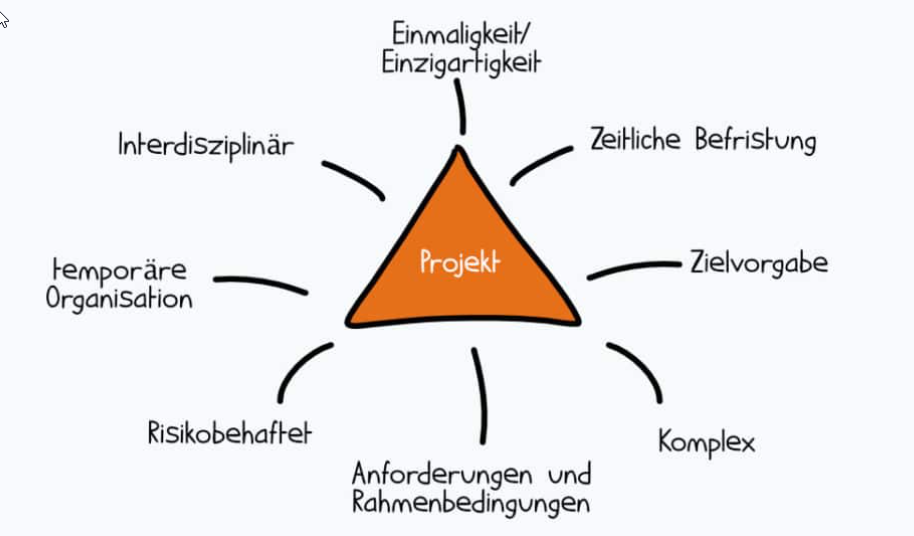

Definition nach DIN 69901
> Ein Projekt ist ein Vorhaben, das im Wesentlichen durch Einmaligkeit der  
> Bedingungen in ihrer Gesamtheit gekennzeichnet ist, wie z.B. Zielvorgabe,  
> zeitliche, finanzielle, personelle oder andere Bedingungen, Abgrenzngen gegen-  
> über anderen Vorhaben und projektspezifische Organisation.  
 
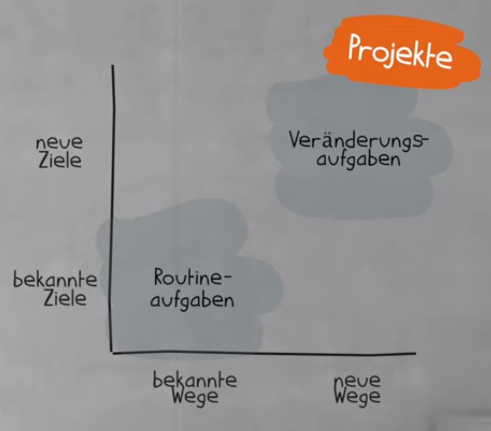

## 6 Merkmale eines Projekts

1. Zielvorgabe
2. zeitliche Begrenzung
3. begrenzte Ressourcen
4. projektspezifische Organisationsform
5. neuartig / einmalig
6. Komplexität

## Projektmanagement Definitionen
DIN 69901
> Das Projektmanagement umfasst die Gesamtheit von Führungsaufgaben, -organisation,  
> -techniken und -mitteln für die Abwicklung eines Projekts.  

Gabler Wirtschaftslexikon
> Projektmanagement umfasst die Führungsaufgaben, -organisation, -techniken und  
> -mittel zur erfolgreichen Abwicklung eines Projekts.  

Komplexe Vorgänge ...
- planen
- durchführen
- steuern
- kontrollieren
- kommunizieren 

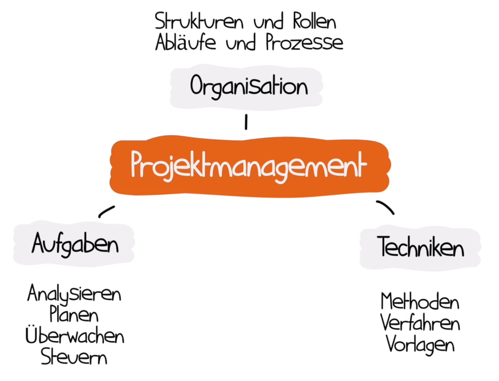

## Vorteile des Projektmanagements 
- Effizienzsteigerung 
  - durch klare Ziele, Zeitpläne, Verantwortlichkeiten
- Kostenkontrolle
  - Planung und Überwachen von Ressourcen
- Risikomanagement
  - potenzielle Probleme früh erkennen
- Qualitätssicherung
  - klare Standards und Kontrollen
- Kommunikation
  - Meetings und Updates halten alle auf dem gleichen Stand

## Einsatzgebiete des Projektmanagements

### Beispiele  
| Unternehmensart/Branche  | Projektarten                |
|--------------------------|-----------------------------|
| Bauunternehm Einf.Häuser | managen von Arbeitspaketen  |
| Werkzeugbau(mittelst.)   | Investitions, Optimierungs, |
|                          | und OrganisationsProjekte   |
| Kreativagenturen         | Kundenprojekte, Websites,   |
|                          | Marketingkampagnen,         |
|                          | IT-Projekte: neue Software  |
| Öffentliche Verwaltung   | neues IT-Sytem, Anpassung   |
|                          | von Prozessen               |
| international tätiger    |                             |
| Versicherungskonzern     | Einführung IT-System,       |
|                          | Verbesserung der Kunden-    |
|                          | zufriedenheit               |

## Projektarten
> bzw Projekttyp, Projektklasse  

Einteilung von Projekten in Gruppen bietet die Möglichkeit der 
- unterschiedlichen Herangehensweise
- unterschiedlichen Risikobetrachtung
- Vergleichbarkeit von Projekten gleicher Gruppen

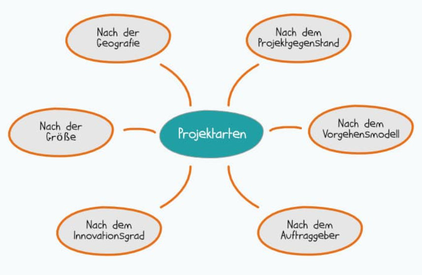

 **Projektgegenstand**
-  Investitions-, Organisations, Forschungs- und Entwicklungsprojekt

 **Vorgehensmodell**
-  traditionell oder agil

 **Auftraggeber**
-  intern oder extern

 **Innovationsgrad**
-  Routine-, Innovations, Akzeptanz- oder Changeprojekt

 **Größe**
-  klein - mittel - groß

 **Geografie**
-  regional, national, international

## Vorgehensmodelle und Projektmanagement-Methoden
- **Vorgehensmodelle:** Es existieren übergreifende Vorgehensmodelle, nach denen  
  ein Projekt abgewickelt wird, z. B. das V-Modell oder Scrum. Diese Vorgehensmodelle  
  werden häufig klassischem oder agilem Projektmanagement zugeordnet und folgen  
  teilweise einem Standard, z. B. dem der IPMA®. Andere Begriffe für  
  Vorgehensmodelle: Projektmanagement-Systeme oder Projektmanagement-Methodiken oder  
  Frameworks. 
- **Projektmanagement-Methoden:** Als Projektmanagement-Methoden bezeichnen wir  
  einzelne Methoden, die innerhalb eines Vorgehensmodells angewendet werden. Hier kann  
  es sich z. B. um eine Risikoanalyse, eine Phasenplanung oder Aufwandsschätzung handeln.

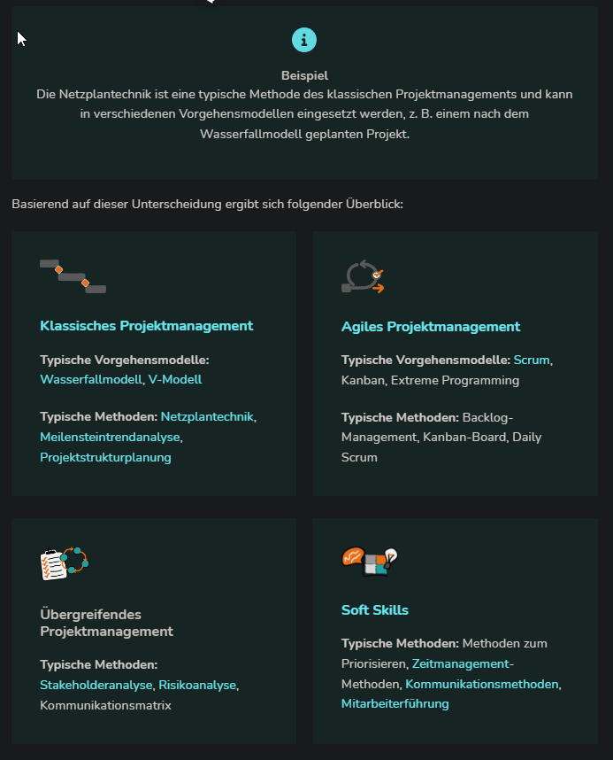

## Klassisches Projektmanagement

Klassisch durchgeführte Projekte sind durch folgende Merkmale gekennzeichnet:
- klar abgegrenzte Phasen (vorher definierte Ergebnisse)
- detaillierte Anforderungen zu Beginn
- intensive Planungsphase
- wenig Änderungen, Änderungen werden als Störungen wahrgenommen
- Einhaltung des Projekt Plans

## Agiles Projektmanagement

Sammelbegriff für verschiedene Projektmanagement-Methoden wie Scrum oder Kanban  

- iterative Abarbeitung in kurzen Zyklen
- Orientierung an Kundenwünschen
- Feedback und Kommunikation
- schnelles, proaktive Reaktions auf Änderungswünsche
- Selbstorganisation der Teams

Es gibt keinen Projektleiter, alle Aufgaben des Projektmanagements verteilen sich  
auf **Product Owner**, **Scrum Master** und die **Entwicklungsteams**.  

## Übergreifendes Projektmanagement

Gilt für agile wie klassische Projekte, schafft einen Rahmen für die eigentlichen  
Projektinhalte.  
- Stakeholeranalyse
- Risikoanalyse
- Kommunikationsmatrix

## Soft Skills

Soft Skills sind Fähigkeiten mit anderen zu inteagieren, also soziale Kompetenz.  
- zeigen sich im Umgang miteinander
- im Verhalten einer Person
- sind teilweise subjektiv
- charakterliche Merkmale
- Lebenserfahrung

Methoden: 
- Priorisierung
- Zeitmanagement
- Kommunikation
- Mitarbeiterführung

## Projektmanagement-Phasen

Eine übersichtliche und allgemein gültige Version ist der Ablauf von  
Projekten in 4 Phasen.

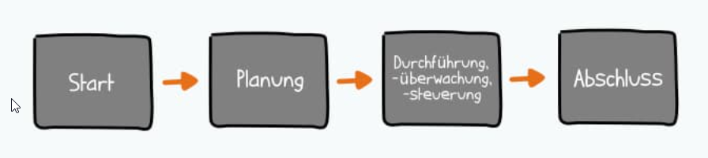

### Magisches Dreieck
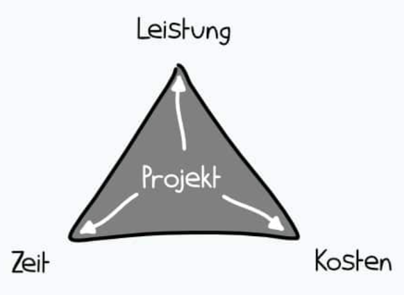

## 1. Projektstart
Der Projektstart ist ein iterativer Prozess.  
Er beinhaltet zum Beispiel
- die erste Projektidee
- eine grobe Dimensionierung des magischen Dreiecks
  - **was** soll bis **wann** zu **welchen Kosten** entstehen
- einen vagen, lückenhaften **Projektsteckbrief**
- Analysen über Stakeholder, Risiken
- Ziele definieren, Kosten und Termine grob planen
- fertiger Projektsteckbrief, wird oft zum offiziellen Projektauftrag

## 2. Projektplanung
Besonders im klassischen Projektmanagement liegt hierauf stark fokussiert.  

- Grobplanung 
  - Phasen und Meilensteine festlegen
  - Projektstrukturplanung
    - Gliederung in Teilprojekte und Arbeitspakete
  - Projektorganisation
    - Rollen und Verantwortlichkeiten abklären
- Feinplanung
  - Ablauf- und Terminplanung
    - Abschätzung von Reihenfolge und Arbeitspaketumfang bzw -dauer
  - Ressourcenplanung, -zuordnung
  - Kostenplanung, ergibt sich aus Dauer und Kosten der Ressourcen

## 3. Projektdurchführung, -überwachung und -steuerung

Häufig die längste Phase
- Erarbeitung der definierten Projektergebnisse
- Überwachung und Analyse
  - ggf Maßnamen ergreifen damit alles der Planung entsprechend läuft

## 4. Projektabschluss

- Abnahme
- Dokumentationsabschluss
- Teamauflösung
- Lessons Learned

# Projektziele

[Wikipedia:](https://de.wikipedia.org/wiki/Projektziel)
> Projektziele sind die Aufstellung von möglichst quantifizierten Anforderungen, 
> die erfüllt sein müssen, damit ein Projekt als erfolgreich abgeschlossen betrachtet  
> werden kann.  

### Magisches Dreieck

Das magische Dreieck beschreibt die drei wichtigsten Zielgrößen eines Projekts:

- Leistung : was, welches Ergebnis wollen wir erreichen bzw erarbeiten?
- Zeit: bis zu welchem Termin soll das Projekt abgeschlossen sein?
- Kosten: wieviel darf es kosten?

> Unklarer Projektumfang und unklare Ziele sind die Hauptfaktoren für  
> das Scheitern von Projekten.  

Diese Funktionen werden durch eine klare Zielstellung erfüllt
- **Kontrollfunktion**
  - am Projektende wird gemessen ob die definierten Kriterien erreicht wurden
- **Orientierungsfunktion**
  - alle Beteiligten richten ihre Arbeit an den Zielen aus
- **Verbindungsfunktion**
  - einheitliches Verständnis räumt Missverständnisse und Unklarheiten aus
- **Koordinationsfunktion**
  - Verantwortlichkeiten werden festgelegt
- **Selektionsfunktion**
  - Entscheidungshilfe bei mehreren Optionen

## Projektziele definieren
1. Ziele ermitteln  
  1a. nicht offensichtlichen Anforderungen bestimmen  
  1b. übergeordnete Unternehmensziele berücksichtigen  
  1c. Projektumfeld, gesetzliche Regelungen
  1d. interessen von Stakeholdern
2. Ziele sauber formulieren (S.M.A.R.T Formel)
3. Nicht-Ziele nennen  
  3a. klarer Verzicht auf Inhalte beugt Missverständnissen vor  
  3b. ein Ausufern des Projekts (Scope Creep) kann verhindert werden
4. Ziele priorisieren: **muss-, soll-, kann-Ziele**  
  4a. Konkurrenz: es soll komplex sein, muss aber schnell gehen  
  4b. muss billig sein, soll aber das beste Ergebnis erzielen
5. Zielbeziehungen analysieren  
  5a. Zielidentität (identische Ziele unterschiedlich formuliert)  
  5b. Zielkomplementarität (gegenseitige Unterstützung)  
  5c. Zielneutralität (keine Beziehungen untereinander, keine Beeinflussung)  
  5d. Zielkonkurrenz (gegenseitige Behinderung)  
  5e. Zielautonomie (Ziele schliessen sich gegenseitig aus)  

## Teilaspekte von Zielen

- **Sachziel** (Endergebnis des Projekts)
  - aus Anforderungsanalyse und Kundengesprächen
  - gewünschtes, spezielles Endergebnis
  - was soll erreicht werden - Kunden und Interessengruppen einbeziehen
  - z.B. Produktentwicklung, System-Implementierung, Dienstleistung
- **Zeitziel**
  - z.B. IHK-Vorgabe, abhängig von notwendigen Zwischenzielen
  - Festlegung von Meilensteinen, Termine für Projektaufgaben
- **Kostenziel**
  - angemessener Einsatz von Ressourcen
  - Schätzung, Kontrolle, Verwaltung von Kosten
  - Prüfung möglicher Kostenreduzierung
- **Qualitätsziel**
  - Qualität des Projekts
  - Kundenzufriedenheit
  - Zuverlässigkeit
  - Einhaltung von Branchen- und Regulierungsstandards

## S.M.A.R.T

- Spezifisch
- Messbar
- Attraktiv, Akzeptiert
- Realistisch
- Terminiert

## CLEAR
- Challenging
- Legal
- Exciting
- Agreed
- Recorded

## PURE
- Positively stated
- Understood
- Realistic
- Ethical

### Faustregel zur Formulierung von Zielen
- Zustandsbeschreibung der Zukunft
- in der Gegenwartsform
- positiv
- Vergleiche vermeiden (höher als, mehr als)
- lieber absolute Werte benutzen (in € oder %)
- nützliche Fragen stellen

## Das Zielkreuz
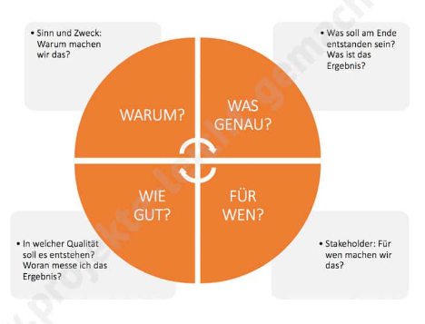

## Stakeholder 
> Gesamtheit aller Projektteilnehmer, -betroffenen und -interessierten,  
> deren Interessen durch den Verlauf oder das Ergebnis des Projektes  
> direkt oder indirekt berührt sin.  

- betroffene,
- beteiligte,
- interessierte Person

### Stakeholder-Analyse
- Identifikation
  - wer ist beteiligt
  - welche Prozesse sind betroffen
- Darstellung der Beziehungen
  - interne - externe Stakeholder
  - Intensität der Beziehung
  - Bedeutung des Stakeholders
- Interpretation und Analyse
  - Erwartungen an das Projekt
  - Ziele und Interessen der Stakeholder
  - Einfluss, Macht und Einstellung zum Projekt (positiv/negativ)
- Ableitung von Maßnahmen
  - Einschätzung von Bedrohungen, Risiken, Chancen
  - Strategie für die Umsetzung
  - Maßnahmen planen
  - Beteiligung der Stakeholder am Projekt  
  

  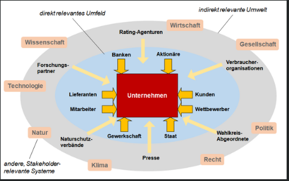

## Nutzwertanalyse

> Die Nutzwertanalyse ist eine Methode zur Planung von systematischen  
> Entscheidungen bei der Auswahl von Handlungsalternativen bei mehreren  
> Zielgrößen.  

### Durchführung (Scoring Modell)
- Bewertungsmaßstäbe (Skala 1-4, gering bis hoch)
- Handlungsalternativen reduzieren
  - nicht realisierbare ausschließen
- Nutzwertanalyse umkehren -> Risikobewertung

1. Festlegen von Entscheidungsalternativen, Problemstellung
2. Definition von Bewertungskriterien (Ziel, Anforderungen erreicht)
3. Gewichtung der kriterien (absolut/prozentual)
4. Festlegen des Bewertungsmaßstabs (Skala 1-6, sehr schlecht - sehr gut)
5. Bewertung, Punktevergabe, Gewichtung
6. Einzelgewichtung aus 5. (gewichtete Punktzahl / Handlungsalternativen)

# Risikomanagement

> Ein Risiko ist ein Ereignis, das nur mit einer gewissen Wahrscheinlichkeit  
> eintritt und das bei Eintritt negative Auswirkungen auf die Erreichung der  
> Projektziele hat.  

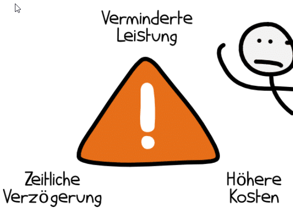

| Ursache        | Risiko             | Auswirkung           |
|----------------|--------------------|----------------------|
| alte Maschinen | Maschine fällt aus | Produktionsrückgang  |

### Ursachen
Über eine Ursache besteht keine Unsicherheit, sie ist eine Tatsache.  
Sie kann zum Eintritt von Risiken führen, muss aber nicht.

### Risiken

- potentielle negative Abweichung im Projektverlauf oder Prozess
- mögliches Problem, das noch nicht eingetreten ist aber eintreten könnte
- Unsicherheit, die sich auf Ziele negativ auswirken kann
- Eintreten von ungeplanten oder *nicht* Eintreten von geplanten Ereignissen

### Auswirkungen
Ergeben sich bei eingetretenem Risiko.  
Äußern sich in einer Abweichung von den Projektzielen und  
verursachen einen Schaden.  

## Die 7 Schritte des Risikomanagements

> Risikomanagement beschreibt alle Aktivitäten,  
> um mit Risiken effektiv umzugehen  
 
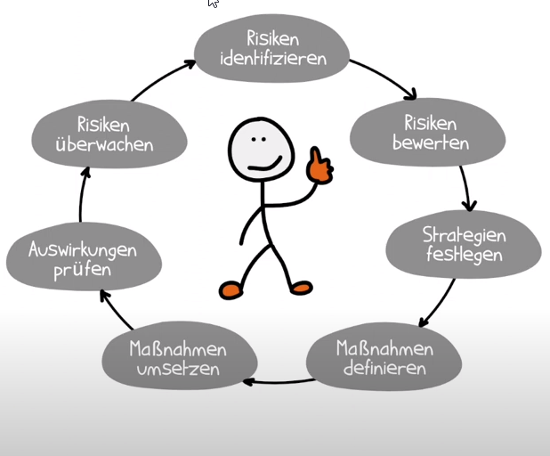

### 1. Identifizieren
> was kann schiefgehen, welche Gefahren lauern, gab es früher schon Probleme  
- Kommunikation mit Stakeholdern, Mitarbeitern
- Umfeldanalyse
### 2. Risiko bewerten
- wie hoch ist die Eintrittswahrscheinlichkeit (EW)
- wie hoch wäre der Schaden, die Tragweite (TW)  

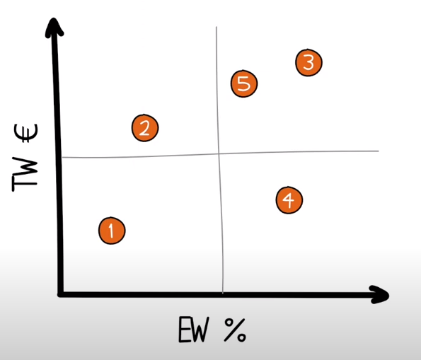 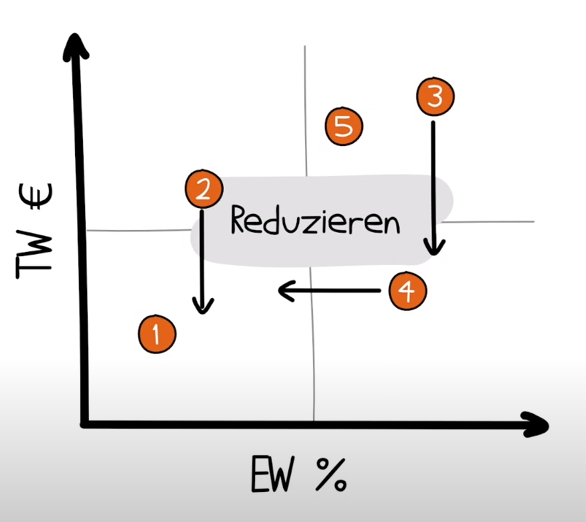 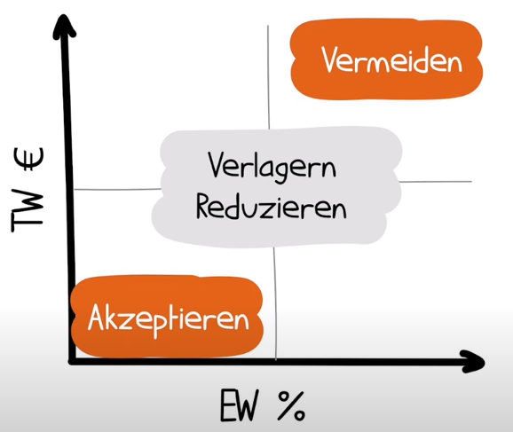

### 3. Strategien entwickeln
- vermeiden
- reduzieren
- verlagern, abwälzen
  - ist nur Sinnvoll, wenn eine realistische Aussicht besteht
  - Übergabe an kompetentere Instanzen oder Partner
  - Auslagerung in Unter- oder Folgeprojekte
- akzeptieren
  - erfordert Monitoring
  - bei Verschlimmerung reagieren, neu bewerten
### 4. Maßnahmen definieren
- Eintrittswahrscheinlichkeit reduzieren (präventiv)
- Tragweite reduzieren (korrektiv)
- Vergleich neue Maschine bereithalten vs Ersatztei lagern
  - 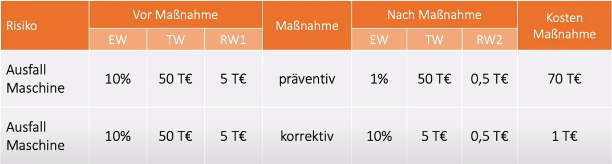

### 5. Maßnahmen umsetzen
- Arbeitspakete definieren
- Verantwortlichkeiten klären
### 6. Auswirkungen prüfen
- wurden Maßnahmen umgesetzt?
- waren sie erfolgreich?
### 7. Risiken überwachen
- hat sich die Risikobewertung verändert?
- sind neue Risiken entstanden?

> Dies ist ein kontinuierlicher Prozess bzw. Kreislauf!

### Verkürzt lässt es sich auf 4 Pukte herunterbrechen:
1. Identifizieren
2. Analysieren
3. Steuern
4. Überwachen

## Eintrittswahrscheinlichkeit (EW in Prozent)
Finden der EW beruht meist nur auf groben Schätzungen
- Betrachtung der Vergangenheit
- Statistiken
- Vergleich von Risiken untereinander
- !gelassen bleiben!

## Tragweite (TW in Geldwert)
Einfacher und genauer als das finden der EW
- welcher Schaden entsteht?
- gibt es eine Verzögerung - wie lange?
- sind Konventionalstrafen zu zahlen?

## Berechnung des Risikowerts (RW)
> RW = EW x TW  
> Der Risikowert macht Risiken besser vergleichbar und Maßnahmen  
> können bewertet werden.  

### Beispiel Risiko Maschinenausfall
EW = 10%
TW = 100.000€
RW = 0.1 x 100.000 = 10.000€

### Beispiel Risiko Ausfall einer Programmiererin
EW = 5%
TW = 10.000€
RW = 0.05 x 10.000€ = 500€

> #### ACHTUNG: Es gibt auch nicht berechenbare, inakzeptable Risiken wie  
> #### die gefährdung von Menschenleben oder Umweltzerstörungen.  

# Qualitätsmanagement
> Qualität ist das Maß in dem ein Objekt den Anforderungen entspricht  
> Um Qualität zu bestimmen bedarf es einer **messbaren Größe**.  
> Es braucht konkrete Kriterien in Form von **Kennzahlen**.  

Objekte in diesem Sinne sind:
- Ware
- Dienstleistungen
- Prozesse

### Teildisziplinen des Qualitätsmanagements
- Qualitätsplanung: Art und Form von Kriterien (frühe Phase)
- Qualitätslenkung und -sicherung: Prozesse, Techniken, Maßnahmen
- Qualitätsprüfung: Abnahme des Projekts

## Qualität im Projektmanagement

- Qualität des Projektinhalts, Produktqualität
- Qualität des Projektmanagements
  - Erreichung von Zeit- und Kostenzielen
  - Einhaltung definierter Prozesse

## Voraussetzungen für Qualitätsmanagement

- festgelegte Kundenanforderungen
- Definition der Umsetzungsmöglichkeiten
- Vereinbarung der Abnahmekriterien
> Ziel ist es Transparenz für alle Beteiligten zu schaffen, damit von  
> vornherein Maßnahmen zur Erreichung aller Qualitätsmerkmale getroffen  
> werden können.  

## Qualitätssicherungsplan

- Was wird gesichert?
  - qualitätsrelevante Merkmale identifizieren
  - Zielgröße feststellen
  - mögliche spätere Abnahmekriterien
- Wann wird gesichert?
  - Festlegung Zeitplan für Messungen
  - regelmäßige Reviews, Messung von Kriterien
  - Meilensteintermine
- Wie wird gesichert?
  - Methoden, Techniken
- Von wem wird gesichert?
  - Verantwortlichkeiten bestimmen
  - Klarheit der Aufgaben

Der Qualitätssicherungsplan kann tabellarischer Natur sein

|Qualitätskriterium|Zielgröße|Maßnahme Qualitätssicherung|Prüfintervall|Verantwortlic|
|------------------|---------|---------------------------|-------------|-------------|   
|                  |         |                           |             |             |

# Lastenheft und Pflichtenheft

## Latenheft (Statement of Work)
> Ein Lastenheft ist ein Dokument, in dem die Anforderungen das Auftraggebers an  
> ein Projektergebnis genau beschrieben werden. Damit wird der sogenannte Leistungsumfang  
> definiert. Traditionell wird ein Lastenheft vom Auftraggeber erstellt und an mögliche  
> Angieter verschickt, die daraufhin ein Angebot erstellen können.  

kurz
- Internes Dokument des **Auftraggebers** über dessen Anforderungen
  - Ziele werden definiert
  - je klarer die Anforderungen, desto weniger Missverständnisse
- Basis für die Einholung von Angeboten verschiedener Anbieter
- Kommunikationsmittel zwischen Auftraggeber und Auftragnehmer

**Im Lastenheft wird nur das WAS beschrieben, nicht das WIE !**

### Vorteile von Lastenheften

- KLarheit über Anforderungen
- Wiedersprüche und Probleme
 - bei der Erstellung des LH können Schwachstellen früh erkannt werden
- Einfacher Prozess beim Einholen von Angeboten
  - Details sind bekannt, Kommunikationsaufwand wird reduziert
- Vergleichbarkeit von Angeboten
  - alle Anbieter haben dieselben Informationen als Grundlage
- Weniger Missverständnisse
  - Funktionen, Anforderungen und Ergebnisse sind bekannt
- Klarheit bei der Abnahme des Projekts
  - Abgleich des Ergebnisses mit den Anforderungen

## Struktur eines Lastenheftes

### 1. **Formelles**
- Kopfdaten: Ersteller, Datum usw.
- Tabelle für Anderungshistorie
- Inhaltsverzeichnit
### 2. **Einführung/Überblick**
- Beschreibung des Arbeitgebers
- ausführliche Beschreibung der Ausgangssituation
- Erläuterung der Problemstellung
### 3. **Ziele und Zielgruppen**
- kann auch in der Einführung stehen
### 4. **Funktionale Anforderungen**
- Detaillierte Beschreibung der Funktionen des Systems oder Prokukts
- damit wird der Leistungsumfang definiert
### 5. **Nichtfunktionale Anforderungen**
- Qualität der Funktionen
  - Reaktionszeiten, Vorgaben zum Design
  - Einhaltung von Gesetzen und Normen
### 6. **Rahmenbedingungen**
- Termine, Meilensteine, Kosten, Gewährleistungen

### Je nach Art des Projekts können weitere Abschnitte vorhanden sein:
- Schnittstellen
- Risiken
- Einschränkungen
- Lieferobjekte
- Anforderungen an den Auftragnehmer
- Angaben zu Kommunikationswegen
- Glossar

## Pflichtenheft

> Dieses Dokument ist oft deutlich ausführlicher als das Lastenheft und wird auf  
> dessen Basis vom Auftragnehmer erstellt. Es beschreibt, wie die Anforderungen  
> konkret umgesetzt werden.  

# Vorgehensmodelle der Softwareentwicklung

## Gängige Vorgehensmodelle

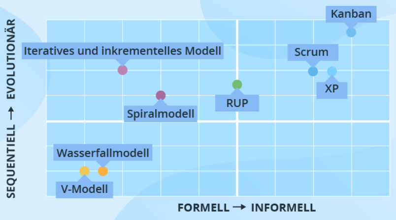  

> Je höher sich die Modelle in der Grafik befinden, desto flexibler wird der  
> Softwareentwicklungsprozess aufgebaut. Untenstehende verfolgen einen sequenziellen  
> Ansatz und sind vergleichsweise einfach zu implementieren, umzusetzen und zu  
> verwalten.  

[Modelle im Überblick](https://www.scnsoft.de/blog/vorgehensmodelle-der-softwareentwicklung)

## Vor- und Nachteile der jeweiligen Modelle
### Wasserfallmodell

| Vorteile                                          | Nachteile                                              |
|---------------------------------------------------|--------------------------------------------------------|
| klar vorgegebene einfache Struktur                | starre Reihenfolge, unflexibel                         |
| sichtbarer Projektfortschritt durch Meilensteine  | spätes Erkennen von Umsetzungsfehlern                  |
| vorab einschätzbarer Arbeitsumfang                | Abgrenzung der Phasen in komplexen Projekten schwierig |
| Planungssicherheit und Kontrolle                  | reibungsloses chronologisches Abarbeiten schwierig     |
| Lösungswege fließen in Planung mit ein            | bei Fehlern und Änderungen oft erneut in Entwurfsphase |
| Kalkulation von Zeit-, Budget- und Arbeitsaufwand | teure Fehlerkorrektur                                  |

### V-Modell

| Vorteile                                             | Nachteile                                            |
|------------------------------------------------------|------------------------------------------------------|
| Früerkennung von unvollst. Spezifikationen (Tests)   | ausführliche Dokumentation aller Ebenen erforderlich |
| einfacher Aufbau, wenig Schulung nötig               | starr und unflexibel                                 |
| wenig Kommunikation zw. Entwicklern und Kunden nötig | zu starke Vereinfachung des Entwicklungsprozesses    |
| Test Team bereits in frühen Phasen eingebunden       | keine Grundlegende Unterscheidung v. Wasserf.Modell  |

### Spiralmodell

| Vorteile                                | Nachteile                                 |
|-----------------------------------------|-------------------------------------------|
| zyklisches Modell                       | keine Standarddokumentation               |
| risikogetrieben                         | kann unendlich weitergehen                |
| Verwendung von Prototyping              | nicht für kleine Projekte geeignet        |
| Kontrolle über alle Phasen              | Experten und Risikoanalysten erforderlich |
| Änderungen/Kundenwünsche umsetzbar      | teuer                                     |
| kann schneller gehen als erwartet       |                                           |
| minimierter Risikofaktor                |                                           |
| frühzeitiger Einblick in System möglich |                                           |

## Scrum

| Vorteile                                             | Nachteile                                                       |
|------------------------------------------------------|-----------------------------------------------------------------|
| wenig Regeln, leicht verständlich schnell einführbar | kein Gesamtüberblick über Projektstrecke                        |
| kurze Kommunikationswege                             | hoher Kommunikations- und Abstimmungsaufwand                    |
| hohe Flexibilität/Agilität durch adaptives Planen    | wenig konkrete Handlungsempfehlungen                            |
| hohe Effektivität durch Selbstorganisation           | Zeitverluste bei defensiven Sprintplanungen                     |
| hohe Transparenz durch regelm. Meetings/Backlogs     | Tunnelblick Gefahr bei Fokussierung auf Tasks                   |
| zeitnahe Realisation neuer Produkteigenschaften      | schwere Koordination vieler Teams in Großprojekten              |
| kontinuierlicher Verbesserungsprozess                | pot. Verunsicherung d. fehlende Zuständigkeiten und Hierarchien |
| kurzfristige Problemidentifikation                   | pot. Unvereinbarkeit mit Unternehmensstrukturen                 |
| geringer Administrations- und Dokumentationsaufwand  |                                                                 |