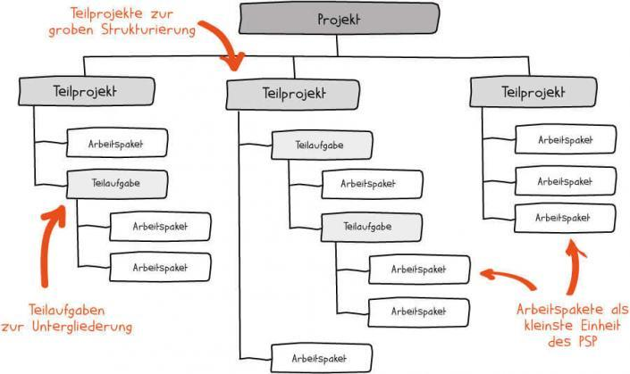
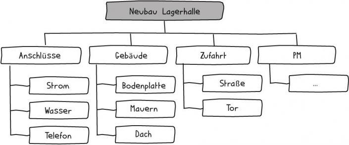
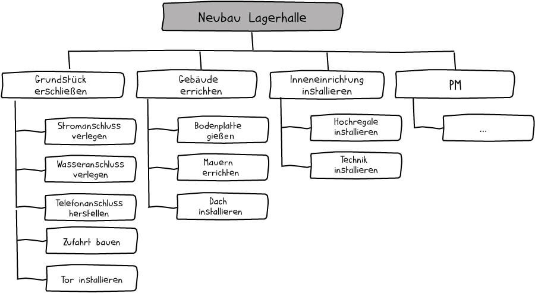
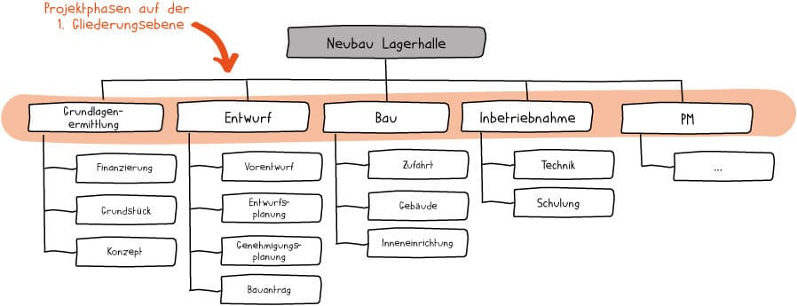
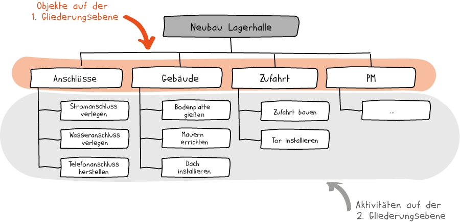
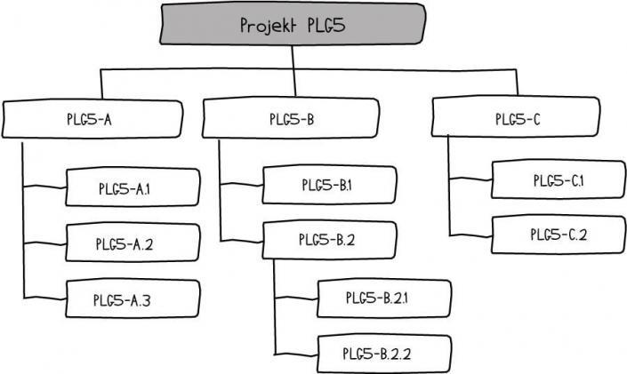

# Projektstrukturplan (PSP)

> Vollständige Darstellung aller inhaltlichen Elemente eines Projekts und ihrer Beziehungen.  
> Wird untergliedert in Teilprojekte, Teilaufgaben und Aufgabenpakete.  
> Hierarchische Darstellung in Baumstruktur, enthält keine Zeitangaben zur Abarbeitung.  
> Typisch für klassisches Projektmanagement (Wasserfallmodell), in agilen Projekten kann  
> es aufgeweichte Formen des PSP geben.

> englische Bezeichnung: WBS (Work Breakdown Structure)

### Vorteile eines PSP

- alles auf einen Blick
- vollständige Darstellung
- Kommunikationsgrundlage
- Basis für Aufgabenverteilung
- im Team erarbeitet
- Grundlage für weitere Pläne

## Gliedeungsprinzipien, Orientierungen

### Objektorientierung
> Der PSP ist nach konkreten Elementen, Bauteilen oder Objekten gegliedert
>

### Aktivitätsorientierung (Funktionsorientierung)
> Tätigkeiten und Aktivitäten stehen im Vordergrund

  

### Phasenorientierung
> Die definierten Projektphasen sind auf der ersten Gliederungsebene.  
> Alle weiteren Ebenen können enweder objekt- oder aktivitätsorientiert sein.

### Gemischtorientierung
> Verschiedene Gliederungsprinzipien können verbunden werden.  
> Aber: auf einer Ebene gibt es immer nur ein Gliederungsprinzip.

## Codierung
> Es gibt verschiedene Arten von Codierungen, um die Elemente im PSP  
> deutlich unterscheidbar zu machen. In der Codierung ist auch die  
> hierarchische Positionierung eines Elements abgebildet.

- Numerische Codierung: 1, 1.1, 1.1.2 usw.
- Dekadische Codierung: 10er Format: 1000, 1100, 1110, usw.
- Alphabetische Codierung: A, AA, AB, usw.
- Alphanumerische Codierung: A, A1, A1.1 usw.

## PSP Erstellung

### 1. Gliederung festlegen
Entscheiden, ob nach Phasen, Objekten oder Aktivitäten  
gegliedert werden soll.
### 2. Vorgehen festlegen
- wer ist alles beteiligt ?
- von oben nach unten aufgliedern oder
- von unten nach oben strukturieren
### 3. Ausgangsinformationen sammeln
Vorhandene Informationen nutzen:
- Risikoanalyse: zu berücksichtigende Maßnahmen einbeziehen
- Maßnahmen aus Stakeholderanalyse einbeziehen
- Aktivitäten aus Zielanalyse ableiten
### 4. Arbeitspakete sammeln
- Aufgaben sammeln z.B. über Brainstorming
- möglichst alle zu erledigenden Aufgaben erfassen
### 5. Arbeitspakete strukturieren
- Zusammenfassen und Untergliedern
    - Teilprojekte
    - Teilaufgaben
    - Arbeitspakete

