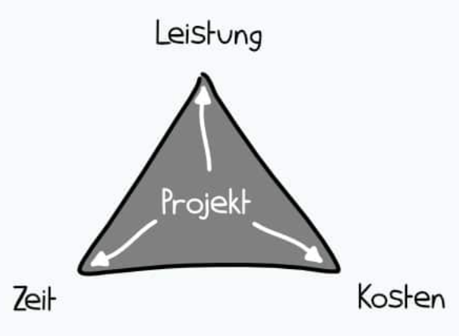
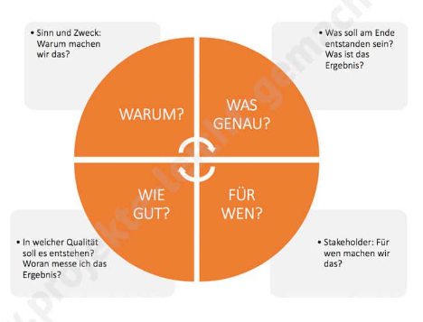

# Projektziele

[Wikipedia:](https://de.wikipedia.org/wiki/Projektziel)
> Projektziele sind die Aufstellung von möglichst quantifizierten Anforderungen,
> die erfüllt sein müssen, damit ein Projekt als erfolgreich abgeschlossen betrachtet  
> werden kann.

### Magisches Dreieck

Das magische Dreieck beschreibt die drei wichtigsten Zielgrößen eines Projekts:

- Leistung : was, welches Ergebnis wollen wir erreichen bzw erarbeiten?
- Zeit: bis zu welchem Termin soll das Projekt abgeschlossen sein?
- Kosten: wieviel darf es kosten?

> Unklarer Projektumfang und unklare Ziele sind die Hauptfaktoren für  
> das Scheitern von Projekten.

Diese Funktionen werden durch eine klare Zielstellung erfüllt
- **Kontrollfunktion**
    - am Projektende wird gemessen ob die definierten Kriterien erreicht wurden
- **Orientierungsfunktion**
    - alle Beteiligten richten ihre Arbeit an den Zielen aus
- **Verbindungsfunktion**
    - einheitliches Verständnis räumt Missverständnisse und Unklarheiten aus
- **Koordinationsfunktion**
    - Verantwortlichkeiten werden festgelegt
- **Selektionsfunktion**
    - Entscheidungshilfe bei mehreren Optionen

## Projektziele definieren
#### 1. Ziele ermitteln
- nicht offensichtlichen Anforderungen bestimmen
- übergeordnete Unternehmensziele berücksichtigen
- Projektumfeld, gesetzliche Regelungen
- Interessen von Stakeholdern
#### 2. Ziele sauber formulieren (S.M.A.R.T Formel)
#### 3. Nicht-Ziele nennen
- klarer Verzicht auf Inhalte beugt Missverständnissen vor
- ein Ausufern des Projekts (Scope Creep) kann verhindert werden
#### 4. Ziele priorisieren: **muss-, soll-, kann-Ziele**
-  Konkurrenz: es soll komplex sein, muss aber schnell gehen
- muss billig sein, soll aber das beste Ergebnis erzielen
#### 5. Zielbeziehungen analysieren
-  Zielidentität (identische Ziele unterschiedlich formuliert)
- Zielkomplementarität (gegenseitige Unterstützung)
- Zielneutralität (keine Beziehungen untereinander, keine Beeinflussung)
- Zielkonkurrenz (gegenseitige Behinderung)
- Zielautonomie (Ziele schliessen sich gegenseitig aus)

## Teilaspekte von Zielen

- **Sachziel** (Endergebnis des Projekts)
    - aus Anforderungsanalyse und Kundengesprächen
    - gewünschtes, spezielles Endergebnis
    - was soll erreicht werden - Kunden und Interessengruppen einbeziehen
    - z.B. Produktentwicklung, System-Implementierung, Dienstleistung
- **Zeitziel**
    - z.B. IHK-Vorgabe, abhängig von notwendigen Zwischenzielen
    - Festlegung von Meilensteinen, Termine für Projektaufgaben
- **Kostenziel**
    - angemessener Einsatz von Ressourcen
    - Schätzung, Kontrolle, Verwaltung von Kosten
    - Prüfung möglicher Kostenreduzierung
- **Qualitätsziel**
    - Qualität des Projekts
    - Kundenzufriedenheit
    - Zuverlässigkeit
    - Einhaltung von Branchen- und Regulierungsstandards

## S.M.A.R.T

- Spezifisch
- Messbar
- Attraktiv, Akzeptiert
- Realistisch
- Terminiert

## CLEAR
- Challenging
- Legal
- Exciting
- Agreed
- Recorded

## PURE
- Positively stated
- Understood
- Realistic
- Ethical

### Faustregel zur Formulierung von Zielen
- Zustandsbeschreibung der Zukunft
- in der Gegenwartsform
- positiv
- Vergleiche vermeiden (höher als, mehr als)
- lieber absolute Werte benutzen (in € oder %)
- nützliche Fragen stellen

## Das Zielkreuz

