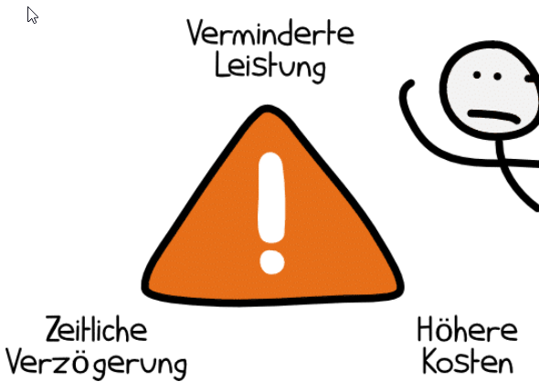
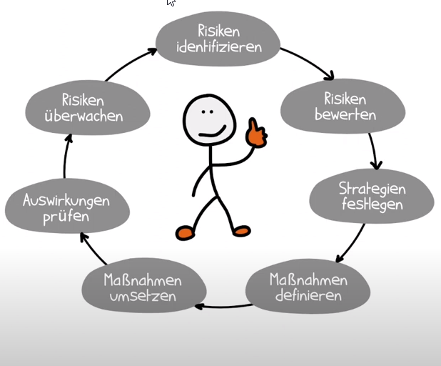
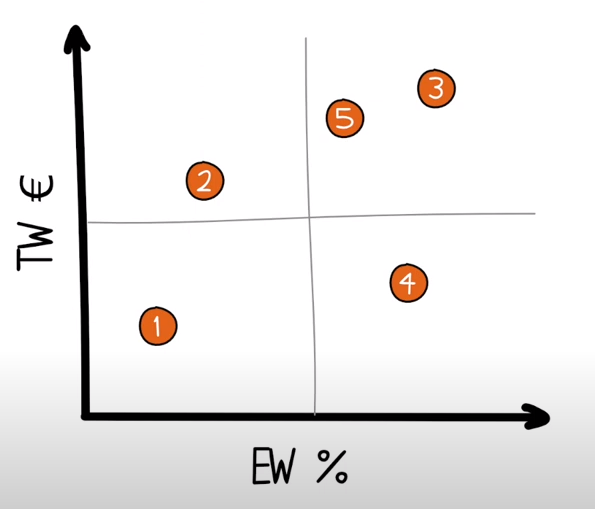
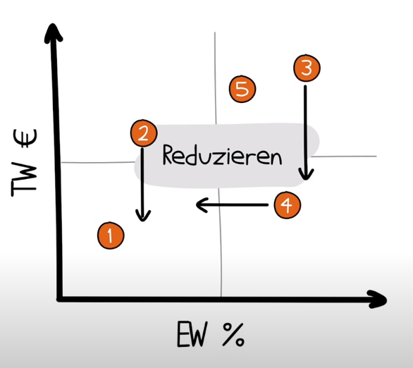
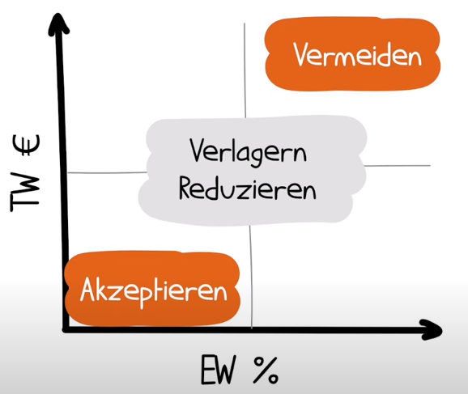
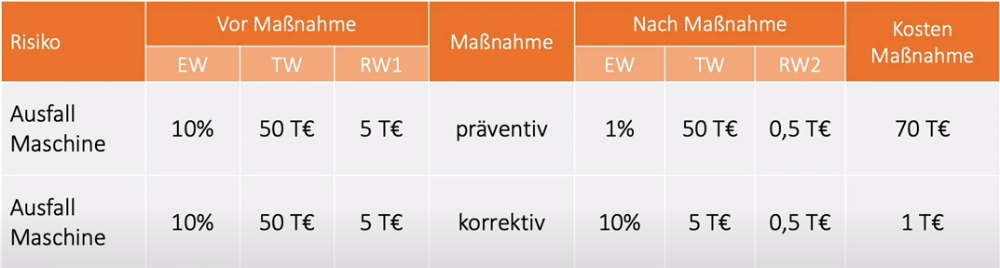

# Risikomanagement

> Ein Risiko ist ein Ereignis, das nur mit einer gewissen Wahrscheinlichkeit  
> eintritt und das bei Eintritt negative Auswirkungen auf die Erreichung der  
> Projektziele hat.

| Ursache        | Risiko             | Auswirkung           |
|----------------|--------------------|----------------------|
| alte Maschinen | Maschine fällt aus | Produktionsrückgang  |

### Ursachen
> Über eine Ursache besteht keine Unsicherheit, sie ist eine Tatsache.  
> Sie kann zum Eintritt von Risiken führen, muss aber nicht.

### Risiken

- potentielle negative Abweichung im Projektverlauf oder Prozess
- mögliches Problem, das noch nicht eingetreten ist aber eintreten könnte
- Unsicherheit, die sich auf Ziele negativ auswirken kann
- Eintreten von ungeplanten oder *nicht* Eintreten von geplanten Ereignissen

### Auswirkungen
- ergeben sich bei eingetretenem Risiko.
- äußern sich in einer Abweichung von den Projektzielen
- verursachen einen Schaden.

## Die 7 Schritte des Risikomanagements

> Risikomanagement beschreibt alle Aktivitäten,  
> um mit Risiken effektiv umzugehen

### 1. Identifizieren
> was kann schiefgehen, welche Gefahren lauern, gab es früher schon Probleme
- Kommunikation mit Stakeholdern, Mitarbeitern
- Umfeldanalyse
### 2. Risiko bewerten
- wie hoch ist die Eintrittswahrscheinlichkeit (EW)
- wie hoch wäre der Schaden, die Tragweite (TW)

  

### 3. Strategien entwickeln
- vermeiden
- reduzieren
- verlagern, abwälzen
    - ist nur Sinnvoll, wenn eine realistische Aussicht besteht
    - Übergabe an kompetentere Instanzen oder Partner
    - Auslagerung in Unter- oder Folgeprojekte
- akzeptieren
    - erfordert Monitoring
    - bei Verschlimmerung reagieren, neu bewerten
### 4. Maßnahmen definieren
- Eintrittswahrscheinlichkeit reduzieren (präventiv)
- Tragweite reduzieren (korrektiv)
- Vergleich neue Maschine bereithalten vs Ersatztei lagern
    - 

### 5. Maßnahmen umsetzen
- Arbeitspakete definieren
- Verantwortlichkeiten klären
### 6. Auswirkungen prüfen
- wurden Maßnahmen umgesetzt?
- waren sie erfolgreich?
### 7. Risiken überwachen
- hat sich die Risikobewertung verändert?
- sind neue Risiken entstanden?

> Dies ist ein kontinuierlicher Prozess bzw. Kreislauf!

### Verkürzt lässt es sich auf 4 Pukte herunterbrechen:
1. Identifizieren
2. Analysieren
3. Steuern
4. Überwachen

## Eintrittswahrscheinlichkeit (EW in Prozent)
Finden der EW beruht meist nur auf groben Schätzungen
- Betrachtung der Vergangenheit
- Statistiken
- Vergleich von Risiken untereinander
- **gelassen bleiben**

## Tragweite (TW in Geldwert)
Einfacher und genauer als das finden der EW
- welcher Schaden entsteht?
- gibt es eine Verzögerung - wie lange?
- sind Konventionalstrafen zu zahlen?

## Berechnung des Risikowerts (RW)
> RW = EW x TW  
> Der Risikowert macht Risiken besser vergleichbar und Maßnahmen  
> können bewertet werden.

### Beispiel Risiko Ausfall einer Maschine
EW = 10%
TW = 100.000€
RW = 0.1 x 100.000 = 10.000€

### Beispiel Risiko Ausfall einer Programmiererin
EW = 5%
TW = 10.000€
RW = 0.05 x 10.000€ = 500€

> #### ACHTUNG: Es gibt auch nicht berechenbare, inakzeptable Risiken wie
> #### die Gefährdung von Menschenleben oder Umweltzerstörungen.  
