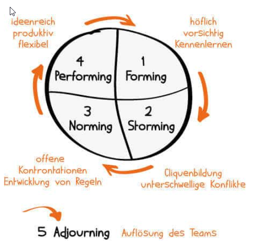

# Die Phasen der Teamentwicklung

## Das Phasenmodell nach Tuckman

> Die einzelnen Phasen sind unterschiedlich stark ausgeprägt  
> und dauern unterschiedlich lang.  

### Faktoren die den Ablauf der Phasen bestimmen:

- Umfeld locker oder starr
- Größe der Gruppe
- Bekanntschaften unter Teammitgliedern
- Erfahrung und Führungskompetenz des Projektleiters

## Die Teamuhr

## 1. Forming (Test-Phase)

> Diese Phase sollte sich nicht allzulange hinziehen.  

- Kennenlernen der Mitglieder
- keine klaren Ziele und Prozesse
- geringe fachliche Leistungsfähigkeit

### Aufgaben für den Projektleiter:

- er ist ein **"guter Gastgeber"**
- unterstützt **Kennenlernprozess**
- **informiert** alle Beteiligten

## 2. Storming (Kampfphase)

> In dieser Phase wird die Komplexität der Aufgabe deutlich.  

- Teammitglieder kommen sich näher (positiv wie nagativ)
- Grüppchenbildung
- Konflikte und Spannungen können entstehen
- erster Motivationseffekt verpufft
- Orientierung auf Probleme

### Aufgaben für den Projektleiter:
 
 - **Schlichter und Antreiber**
 - das Team **machen lassen**
 - **Konflikte offenlegen**
 - **offenes Klima** schaffen
 - agiert **deeskalierend**
 - **fokussiert** auf Projektziele

## 3. Norming (Organisationsphase)

- Arbeitsprozesse und -regeln bilden sich heraus
- offene Diskussion
- offene Konfrontation
- Rollen- und Aufgabenverteilung
- Miteinander ist positiv und lösungsorientierter

### Aufgaben für den Projektleiter:

- Rolle als **Berater oder Coach**
- begleitend bei der **Spielregelfindung**
- verantwortlich für **Spielregeleinhaltung**
- Teamführung nun **aufgabenorientierter**

## 4. Performing (Hochleistungsphase)

- Team arbeitet **eigenständig**, **leistungsfähig** und **effizient**
- geprägt von **Wertschätzung** und **gegenseitigem Respekt**
- der Arbeitsstil ist **konstruktiv** und **lösungsorientiert**

### Aufgaben für den Projektleiter:

- er muss kaum noch eingreifen
- Zielvorgaben, Motivation und Weiterentwicklung der Mitarbeiter

## 5. Adjourning (Auflösungsphase)

> Ergänzung zur Teamuhr. Aktiv vom Projektleiter gestalteter  
> Auflösungsprozess um die vollbrachte Leistung zu würdigen  
> und das Projekt angemessen abzuschliessen.  
