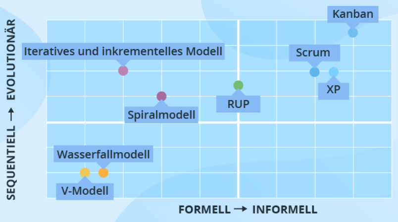
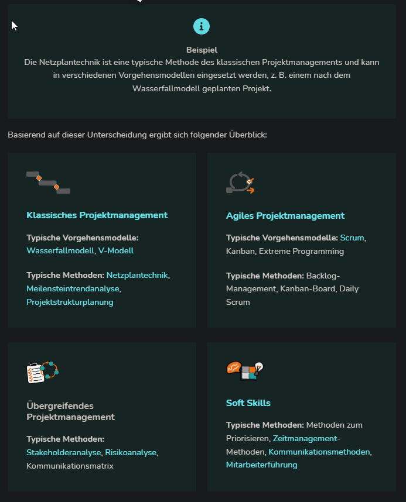
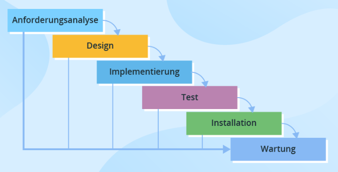
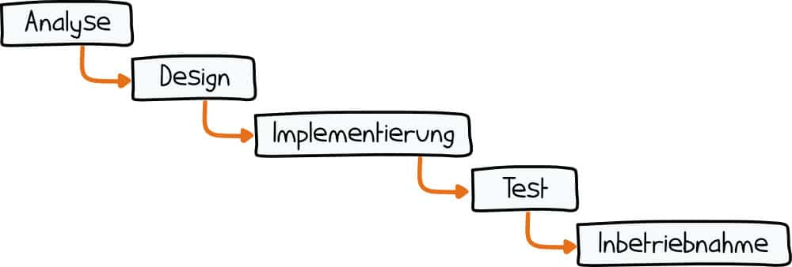

# Vorgehensmodelle der Softwareentwicklung

## Gängige Vorgehensmodelle

  

> Je höher sich die Modelle in der Grafik befinden, desto flexibler wird der  
> Softwareentwicklungsprozess aufgebaut. Untenstehende verfolgen einen sequenziellen  
> Ansatz und sind vergleichsweise einfach zu implementieren, umzusetzen und zu  
> verwalten.

[Modelle im Überblick](https://www.scnsoft.de/blog/vorgehensmodelle-der-softwareentwicklung)

## Vorgehensmodelle und Projektmanagement-Methoden
- **Vorgehensmodelle:** Es existieren übergreifende Vorgehensmodelle, nach denen  
  ein Projekt abgewickelt wird, z. B. das V-Modell oder Scrum. Diese Vorgehensmodelle  
  werden häufig klassischem oder agilem Projektmanagement zugeordnet und folgen  
  teilweise einem Standard, z. B. dem der IPMA®. Andere Begriffe für  
  Vorgehensmodelle: Projektmanagement-Systeme oder Projektmanagement-Methodiken oder  
  Frameworks.
- **Projektmanagement-Methoden:** Als Projektmanagement-Methoden bezeichnen wir  
  einzelne Methoden, die innerhalb eines Vorgehensmodells angewendet werden. Hier kann  
  es sich z. B. um eine Risikoanalyse, eine Phasenplanung oder Aufwandsschätzung handeln.

## Klassisches Projektmanagement

Klassisch durchgeführte Projekte sind durch folgende Merkmale gekennzeichnet:
- klar abgegrenzte Phasen (vorher definierte Ergebnisse)
- detaillierte Anforderungen zu Beginn
- intensive Planungsphase
- wenig Änderungen, Änderungen werden als Störungen wahrgenommen
- Einhaltung des Projekt Plans

## Agiles Projektmanagement

Sammelbegriff für verschiedene Projektmanagement-Methoden wie Scrum oder Kanban

- iterative Abarbeitung in kurzen Zyklen
- Orientierung an Kundenwünschen
- Feedback und Kommunikation
- schnelle, proaktive Reaktion auf Änderungswünsche
- Selbstorganisation der Teams

Es gibt keinen Projektleiter, alle Aufgaben des Projektmanagements verteilen sich  
auf **Product Owner**, **Scrum Master** und die **Entwicklungsteams**.

## Übergreifendes Projektmanagement

Gilt für agile wie klassische Projekte, schafft einen Rahmen für die eigentlichen  
Projektinhalte.
- Stakeholeranalyse
- Risikoanalyse
- Kommunikationsmatrix

## Soft Skills

Soft Skills sind Fähigkeiten mit anderen zu interagieren, also soziale Kompetenz.
- zeigen sich im Umgang miteinander
- im Verhalten einer Person
- sind teilweise subjektiv
- charakterliche Merkmale
- Lebenserfahrung

Methoden:
- Priorisierung
- Zeitmanagement
- Kommunikation
- Mitarbeiterführung

## Wasserfallmodell
> Ist linear, hat festgelegte Projektphasen, die nacheinander und einmalig durchlaufen  
> werden. Es eignet sich für Projekte, in denen die Anforderungen von Beginn an klar und  
> vollständig sind und in denen wenige Änderungen erwartet werden.  
> Gehört zum klassischen Projektmanagement.  

Definition nach Gabler Wirtschaftslexikon  
> lineares Vorgehensmodell der Softwareentwicklung, das sich in die sechs Phasen gliedert.  
> ...Die sechs Phasen werden streng nacheinander ohne Iterationen durchlaufen.  

  

### Merkmale
- linear
- fest definierte Phasen
- Phasen werden einmal durchlaufen und werden 
- durch Meilensteine (Zwischenergebnisse) abgeschlossen
- Phasen bauen aufeinander auf
- fester Start- und Endtermin

### geeignet für Projekte, die
- sich im Detail planen lassen und linear abgearbeitet werden können
- klare und vollständige Anforderungen und Spezifikationen haben
- einen festen Start- und Endtermin vorsehen
- weniger Änderungen bedürfen
- ein hierarchisches Projektumfeld mit langen Entscheidungswegen haben
- von traditionellen Unternehmen mit festen Strukturen umgesetzt werden

## Die Phasen
### 1. Anforderungsanalyse, Requirements
- Was soll entwickelt werden?
- Anforderungen so genau wie möglich definieren  
  damit die Erfolgschancen hoch sind
### 2. Entwurf, Design
- Wie sollen die Anforderungen umgesetzt werden?
- Das Team legt die Spezifikationen fest
### 3. Implementierung, Implementation
- Anforderungen umsetzen (Codierung)
- Entstehungsphase des Produkts
### 4. Test, Verification
- entspricht das Produkt den Anforderungen?
### 5. Inbetriebnahme und Wartung, Maintenance
- Einsatz in produktiver Umgebung
- Fehler werden behoben

## Vor- und Nachteile der jeweiligen Modelle
### Wasserfallmodell

| Vorteile                                          | Nachteile                                              |
|---------------------------------------------------|--------------------------------------------------------|
| klar vorgegebene einfache Struktur                | starre Reihenfolge, unflexibel                         |
| sichtbarer Projektfortschritt durch Meilensteine  | spätes Erkennen von Umsetzungsfehlern                  |
| vorab einschätzbarer Arbeitsumfang                | detaillierte Planung in komplexen Projekten schwierig  |
| Planungssicherheit und Kontrolle                  | reibungsloses chronologisches Abarbeiten schwierig     |
| Lösungswege fließen in Planung mit ein            | bei Fehlern und Änderungen oft erneut in Entwurfsphase |
| Kalkulation von Zeit-, Budget- und Arbeitsaufwand | teure Fehlerkorrektur                                  |

### V-Modell

| Vorteile                                             | Nachteile                                            |
|------------------------------------------------------|------------------------------------------------------|
| Früerkennung von unvollst. Spezifikationen (Tests)   | ausführliche Dokumentation aller Ebenen erforderlich |
| einfacher Aufbau, wenig Schulung nötig               | starr und unflexibel                                 |
| wenig Kommunikation zw. Entwicklern und Kunden nötig | zu starke Vereinfachung des Entwicklungsprozesses    |
| Test Team bereits in frühen Phasen eingebunden       | keine Grundlegende Unterscheidung v. Wasserf.Modell  |

### Spiralmodell

| Vorteile                                | Nachteile                                 |
|-----------------------------------------|-------------------------------------------|
| zyklisches Modell                       | keine Standarddokumentation               |
| risikogetrieben                         | kann unendlich weitergehen                |
| Verwendung von Prototyping              | nicht für kleine Projekte geeignet        |
| Kontrolle über alle Phasen              | Experten und Risikoanalysten erforderlich |
| Änderungen/Kundenwünsche umsetzbar      | teuer                                     |
| kann schneller gehen als erwartet       |                                           |
| minimierter Risikofaktor                |                                           |
| frühzeitiger Einblick in System möglich |                                           |

## Scrum

| Vorteile                                             | Nachteile                                                       |
|------------------------------------------------------|-----------------------------------------------------------------|
| wenig Regeln, leicht verständlich schnell einführbar | kein Gesamtüberblick über Projektstrecke                        |
| kurze Kommunikationswege                             | hoher Kommunikations- und Abstimmungsaufwand                    |
| hohe Flexibilität/Agilität durch adaptives Planen    | wenig konkrete Handlungsempfehlungen                            |
| hohe Effektivität durch Selbstorganisation           | Zeitverluste bei defensiven Sprintplanungen                     |
| hohe Transparenz durch regelm. Meetings/Backlogs     | Tunnelblick Gefahr bei Fokussierung auf Tasks                   |
| zeitnahe Realisation neuer Produkteigenschaften      | schwere Koordination vieler Teams in Großprojekten              |
| kontinuierlicher Verbesserungsprozess                | pot. Verunsicherung d. fehlende Zuständigkeiten und Hierarchien |
| kurzfristige Problemidentifikation                   | pot. Unvereinbarkeit mit Unternehmensstrukturen                 |
| geringer Administrations- und Dokumentationsaufwand  |                                                                 |

